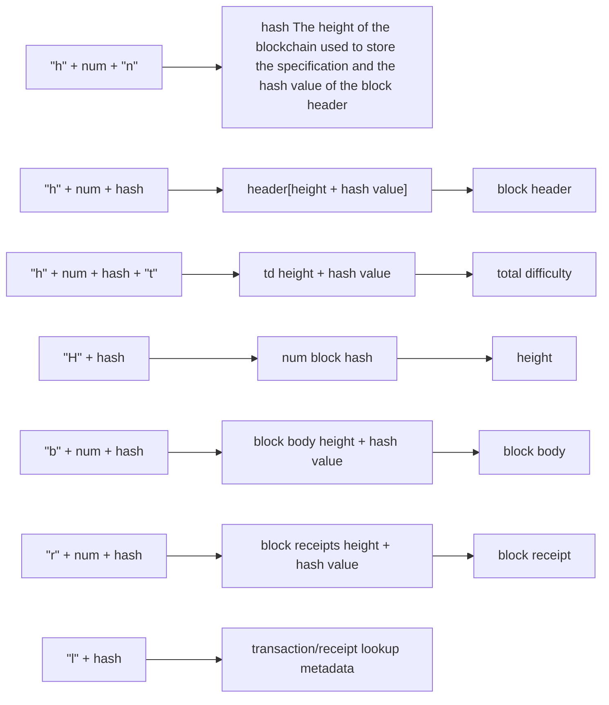

From the test case, the main function points of blockchain are as follows.

1. import.
2. GetLastBlock features.
3. If there are multiple blockchains, you can select the one with the most difficulty as the canonical blockchain.
4. BadHashes can manually disable the hash value of some blocks. Inside blocks.go.
5. If BadHashes is newly configured, then when the block is started, it will be automatically disabled and enter the valid state.
6. The wrong nonce will be rejected.
7. Support for Fast importing.
8. Light vs Fast vs Full processing has the same effect on the processing block header.

It can be seen that the main function of the blockchain is to maintain the state of the blockchain, including block verification, insertion and status query.

Glossary:

What is the canonical blockchain?
Because in the process of creating the block, some forks may be generated in a short time. In our database, it is actually a block tree. We think that one of the most difficult paths is considered to be our specification. Blockchain. There are many blocks that can form a blockchain, but not a canonical blockchain.  
Database structure:

	Is the hash value of the block the same as the hash value of the block header? The hash value of the so-called block is actually the block value of the Header.

	// key -> value
	// + Representative connection

	"LastHeader"  The latest block header used in HeaderChain
	"LastBlock"   The latest block header used in BlockChain
	"LastFast"    The latest fast sync block header



| key                    | value              | description                                                                                                                     | insert                                                                                  | delete                                                                                                                                                                                                                                                                      |
| ---------------------- | ------------------ | ------------------------------------------------------------------------------------------------------------------------------- | --------------------------------------------------------------------------------------- | --------------------------------------------------------------------------------------------------------------------------------------------------------------------------------------------------------------------------------------------------------------------------- |
| "LastHeader"           | hash               | The latest block header used in HeaderChain                                                                                     | When the block is considered to be the latest block of the current specification block  | Replace it with an updated blockchain or a forked sibling blockchain                                                                                                                                                                                                        |
| "LastBlock"            | hash               | The latest block header used in BlockChain                                                                                      | When the block is considered to be the latest block of the current specification block  | Replace it with an updated blockchain or a forked sibling blockchain                                                                                                                                                                                                        |
| "LastFast"             | hash               | The latest block header used in BlockChain                                                                                      | When the block is considered to be the block header of the current latest specification | Replace it with an updated blockchain or a forked sibling blockchain                                                                                                                                                                                                        |
| "h"+num+"n"            | hash               | The height of the blockchain used to store the specification and the hash value of the block header are used in the HeaderChain | When the block is in the canonical blockchain                                           | When the block is not in the canonical blockchain                                                                                                                                                                                                                           |
| "h" + num + hash + "t" | td                 | Total difficulty                                                                                                                | WriteBlockAndState after validating and executing a block (whether or not it is normal) | The SetHead method will be called. This method will only be called in two cases. 1 is that the current blockchain contains badhashs, and all blocks starting from badhashs need to be deleted. 2. The current block is in the wrong state and needs to be reset to genesis. |
| "H" + hash             | num                | The height of the block is used in HeaderChain                                                                                  | WriteBlockAndState after verifying and executing a block                                | Called in in the SetHead.                                                                                                                                                                                                                                                   |
| "b" + num + hash       | block body         | Block data                                                                                                                      | WriteBlockAndState or InsertReceiptChain                                                | Deleted in the SetHead                                                                                                                                                                                                                                                      |
| "r" + num + hash       | block receipts     | Block receipts                                                                                                                  | WriteBlockAndState or InsertReceiptChain                                                | Same place                                                                                                                                                                                                                                                                  |
| "l" + txHash           | {hash,num,TxIndex} | Trading hashes can find blocks and trades                                                                                       | When a block joins a canonical blockchain                                               | When the block is removed from the canonical blockchain                                                                                                                                                                                                                     |


data structure

```go	
// BlockChain represents the canonical chain given a database with a genesis
// block. The Blockchain manages chain imports, reverts, chain reorganisations.
// Importing blocks in to the block chain happens according to the set of rules
// defined by the two stage Validator. Processing of blocks is done using the
// Processor which processes the included transaction. The validation of the state
// is done in the second part of the Validator. Failing results in aborting of
// the import.
// The BlockChain also helps in returning blocks from **any** chain included
// in the database as well as blocks that represents the canonical chain. It's
// important to note that GetBlock can return any block and does not need to be
// included in the canonical one where as GetBlockByNumber always represents the
// canonical chain.
type BlockChain struct {
	config *params.ChainConfig // chain & network configuration

	hc            *HeaderChain		// Blockchain containing only block headers
	chainDb       ethdb.Database	// Underlying database
	rmLogsFeed    event.Feed		// Below are the components of many message notifications.
	chainFeed     event.Feed
	chainSideFeed event.Feed
	chainHeadFeed event.Feed
	logsFeed      event.Feed
	scope         event.SubscriptionScope
	genesisBlock  *types.Block		// genesis block

	mu      sync.RWMutex // global mutex for locking chain operations
	chainmu sync.RWMutex // blockchain insertion lock
	procmu  sync.RWMutex // block processor lock

	checkpoint       int          // checkpoint counts towards the new checkpoint
	currentBlock     *types.Block // Current head of the block chain 
	currentFastBlock *types.Block // Current head of the fast-sync chain (may be above the block chain!) 

	stateCache   state.Database // State database to reuse between imports (contains state cache)
	bodyCache    *lru.Cache     // Cache for the most recent block bodies
	bodyRLPCache *lru.Cache     // Cache for the most recent block bodies in RLP encoded format
	blockCache   *lru.Cache     // Cache for the most recent entire blocks
	futureBlocks *lru.Cache     // future blocks are blocks added for later processing  

	quit    chan struct{} // blockchain quit channel
	running int32         // running must be called atomically
	// procInterrupt must be atomically called
	procInterrupt int32          // interrupt signaler for block processing
	wg            sync.WaitGroup // chain processing wait group for shutting down

	engine    consensus.Engine	// can be dpos, pos, pow, mbfa
	processor Processor // block processor interface  
	validator Validator // block and state validator interface 
	vmConfig  vm.Config // Virtual machine configuration

	badBlocks *lru.Cache // Bad block cache
}
```	

Construction, NewBlockChain uses the information available in the database to construct an initialized blockchain. At the same time initializes the Ethereum default validator and processor (Validator and Processor)
```go	
// NewBlockChain returns a fully initialised block chain using information
// available in the database. It initialises the default Ethereum Validator and
// Processor.
func NewBlockChain(chainDb ethdb.Database, config *params.ChainConfig, engine consensus.Engine, vmConfig vm.Config) (*BlockChain, error) {
	bodyCache, _ := lru.New(bodyCacheLimit)
	bodyRLPCache, _ := lru.New(bodyCacheLimit)
	blockCache, _ := lru.New(blockCacheLimit)
	futureBlocks, _ := lru.New(maxFutureBlocks)
	badBlocks, _ := lru.New(badBlockLimit)

	bc := &BlockChain{
		config:       config,
		chainDb:      chainDb,
		stateCache:   state.NewDatabase(chainDb),
		quit:         make(chan struct{}),
		bodyCache:    bodyCache,
		bodyRLPCache: bodyRLPCache,
		blockCache:   blockCache,
		futureBlocks: futureBlocks,
		engine:       engine,
		vmConfig:     vmConfig,
		badBlocks:    badBlocks,
	}
	bc.SetValidator(NewBlockValidator(config, bc, engine))
	bc.SetProcessor(NewStateProcessor(config, bc, engine))

	var err error
	bc.hc, err = NewHeaderChain(chainDb, config, engine, bc.getProcInterrupt)
	if err != nil {
		return nil, err
	}
	bc.genesisBlock = bc.GetBlockByNumber(0)  // get the genesis block
	if bc.genesisBlock == nil {
		return nil, ErrNoGenesis
	}
	if err := bc.loadLastState(); err != nil { // load the latest status
		return nil, err
	}
	// Check the current state of the block hashes and make sure that we do not have any of the bad blocks in our chain
	for hash := range BadHashes {
		if header := bc.GetHeaderByHash(hash); header != nil {
			// get the canonical block corresponding to the offending header's number
			headerByNumber := bc.GetHeaderByNumber(header.Number.Uint64())
			// make sure the headerByNumber (if present) is in our current canonical chain
			if headerByNumber != nil && headerByNumber.Hash() == header.Hash() {
				log.Error("Found bad hash, rewinding chain", "number", header.Number, "hash", header.ParentHash)
				bc.SetHead(header.Number.Uint64() - 1)
				log.Error("Chain rewind was successful, resuming normal operation")
			}
		}
	}
	// Take ownership of this particular state
	go bc.update()
	return bc, nil
}
```

loadLastState, loads the latest blockchain state we know in the database. This method assumes that the lock has been acquired.

```go	
// loadLastState loads the last known chain state from the database. This method
// assumes that the chain manager mutex is held.
func (bc *BlockChain) loadLastState() error {
	// Restore the last known head block
	head := GetHeadBlockHash(bc.chainDb)
	if head == (common.Hash{}) { // If the acquisition is empty, then the database is considered corrupted. Then set the blockchain to be the genesis block.
		// Corrupt or empty database, init from scratch
		log.Warn("Empty database, resetting chain")
		return bc.Reset()
	}
	// Make sure the entire head block is available
	currentBlock := bc.GetBlockByHash(head)
	if currentBlock == nil {
		// Corrupt or empty database, init from scratch
		log.Warn("Head block missing, resetting chain", "hash", head)
		return bc.Reset()
	}
	// Make sure the state associated with the block is available
	if _, err := state.New(currentBlock.Root(), bc.stateCache); err != nil {
		// Dangling block without a state associated, init from scratch
		log.Warn("Head state missing, resetting chain", "number", currentBlock.Number(), "hash", currentBlock.Hash())
		return bc.Reset()
	}
	// Everything seems to be fine, set as the head block
	bc.currentBlock = currentBlock

	// Restore the last known head header
	currentHeader := bc.currentBlock.Header()
	if head := GetHeadHeaderHash(bc.chainDb); head != (common.Hash{}) {
		if header := bc.GetHeaderByHash(head); header != nil {
			currentHeader = header
		}
	}
	// header chain 
	bc.hc.SetCurrentHeader(currentHeader)

	// Restore the last known head fast block
	bc.currentFastBlock = bc.currentBlock
	if head := GetHeadFastBlockHash(bc.chainDb); head != (common.Hash{}) {
		if block := bc.GetBlockByHash(head); block != nil {
			bc.currentFastBlock = block
		}
	}

	// Issue a status log for the user 
	headerTd := bc.GetTd(currentHeader.Hash(), currentHeader.Number.Uint64())
	blockTd := bc.GetTd(bc.currentBlock.Hash(), bc.currentBlock.NumberU64())
	fastTd := bc.GetTd(bc.currentFastBlock.Hash(), bc.currentFastBlock.NumberU64())

	log.Info("Loaded most recent local header", "number", currentHeader.Number, "hash", currentHeader.Hash(), "td", headerTd)
	log.Info("Loaded most recent local full block", "number", bc.currentBlock.Number(), "hash", bc.currentBlock.Hash(), "td", blockTd)
	log.Info("Loaded most recent local fast block", "number", bc.currentFastBlock.Number(), "hash", bc.currentFastBlock.Hash(), "td", fastTd)

	return nil
}
```

The processing of goroutine update is very simple. Timed processing of future blocks each 5 seconds.
```go
func (bc *BlockChain) update() {
	futureTimer := time.Tick(5 * time.Second)
	for {
		select {
		case <-futureTimer:
			bc.procFutureBlocks()
		case <-bc.quit:
			return
		}
	}
}
```
The processing of goroutine update is very simple. Timed processing of future blocks.
```go	
// Reset purges the entire blockchain, restoring it to its genesis state.
func (bc *BlockChain) Reset() error {
	return bc.ResetWithGenesisBlock(bc.genesisBlock)
}

// ResetWithGenesisBlock purges the entire blockchain, restoring it to the
// specified genesis state.
func (bc *BlockChain) ResetWithGenesisBlock(genesis *types.Block) error {
	// Dump the entire block chain and purge the caches
	if err := bc.SetHead(0); err != nil {
		return err
	}
	bc.mu.Lock()
	defer bc.mu.Unlock()

	// Prepare the genesis block and reinitialise the chain
	if err := bc.hc.WriteTd(genesis.Hash(), genesis.NumberU64(), genesis.Difficulty()); err != nil {
		log.Crit("Failed to write genesis block TD", "err", err)
	}
	if err := WriteBlock(bc.chainDb, genesis); err != nil {
		log.Crit("Failed to write genesis block", "err", err)
	}
	bc.genesisBlock = genesis
	bc.insert(bc.genesisBlock)
	bc.currentBlock = bc.genesisBlock
	bc.hc.SetGenesis(bc.genesisBlock.Header())
	bc.hc.SetCurrentHeader(bc.genesisBlock.Header())
	bc.currentFastBlock = bc.genesisBlock

	return nil
}
```
SetHead rolls back the local chain to the new header. Everything above a given new header will be deleted and the new header will be set. If the block is lost (non-archive nodes after fast synchronization), the header may be further rewinded.
```go
// SetHead rewinds the local chain to a new head. In the case of headers, everything
// above the new head will be deleted and the new one set. In the case of blocks
// though, the head may be further rewound if block bodies are missing (non-archive
// nodes after a fast sync).
func (bc *BlockChain) SetHead(head uint64) error {
	log.Warn("Rewinding blockchain", "target", head)

	bc.mu.Lock()
	defer bc.mu.Unlock()

	// Rewind the header chain, deleting all block bodies until then
	delFn := func(hash common.Hash, num uint64) {
		DeleteBody(bc.chainDb, hash, num)
	}
	bc.hc.SetHead(head, delFn)
	currentHeader := bc.hc.CurrentHeader()

	// Clear out any stale content from the caches
	bc.bodyCache.Purge()
	bc.bodyRLPCache.Purge()
	bc.blockCache.Purge()
	bc.futureBlocks.Purge()

	// Rewind the block chain, ensuring we don't end up with a stateless head block
	if bc.currentBlock != nil && currentHeader.Number.Uint64() < bc.currentBlock.NumberU64() {
		bc.currentBlock = bc.GetBlock(currentHeader.Hash(), currentHeader.Number.Uint64())
	}
	if bc.currentBlock != nil {
		if _, err := state.New(bc.currentBlock.Root(), bc.stateCache); err != nil {
			// Rewound state missing, rolled back to before pivot, reset to genesis
			bc.currentBlock = nil
		}
	}
	// Rewind the fast block in a simpleton way to the target head
	if bc.currentFastBlock != nil && currentHeader.Number.Uint64() < bc.currentFastBlock.NumberU64() {
		bc.currentFastBlock = bc.GetBlock(currentHeader.Hash(), currentHeader.Number.Uint64())
	}
	// If either blocks reached nil, reset to the genesis state
	if bc.currentBlock == nil {
		bc.currentBlock = bc.genesisBlock
	}
	if bc.currentFastBlock == nil {
		bc.currentFastBlock = bc.genesisBlock
	}
	if err := WriteHeadBlockHash(bc.chainDb, bc.currentBlock.Hash()); err != nil {
		log.Crit("Failed to reset head full block", "err", err)
	}
	if err := WriteHeadFastBlockHash(bc.chainDb, bc.currentFastBlock.Hash()); err != nil {
		log.Crit("Failed to reset head fast block", "err", err)
	}
	return bc.loadLastState()
}
```

InsertChain, insert the blockchain, insert the blockchain to try to insert the given block into the canonical chain, or create a fork. If an error occurs, it will return the index and the specific error message when the error occurred.
```go	
// InsertChain attempts to insert the given batch of blocks in to the canonical
// chain or, otherwise, create a fork. If an error is returned it will return
// the index number of the failing block as well an error describing what went
// wrong.
//
// After insertion is done, all accumulated events will be fired.
func (bc *BlockChain) InsertChain(chain types.Blocks) (int, error) {
	n, events, logs, err := bc.insertChain(chain)
	bc.PostChainEvents(events, logs)
	return n, err
}
```
The insertChain method performs blockchain insertion and collects event information. Since defer is required to handle unlocking, this method is treated as a separate method.
```go
// insertChain will execute the actual chain insertion and event aggregation. The
// only reason this method exists as a separate one is to make locking cleaner
// with deferred statements.
func (bc *BlockChain) insertChain(chain types.Blocks) (int, []interface{}, []*types.Log, error) {
	// Do a sanity check that the provided chain is actually ordered and linked
	for i := 1; i < len(chain); i++ {
		if chain[i].NumberU64() != chain[i-1].NumberU64()+1 || chain[i].ParentHash() != chain[i-1].Hash() {
			// Chain broke ancestry, log a messge (programming error) and skip insertion
			log.Error("Non contiguous block insert", "number", chain[i].Number(), "hash", chain[i].Hash(),
				"parent", chain[i].ParentHash(), "prevnumber", chain[i-1].Number(), "prevhash", chain[i-1].Hash())

			return 0, nil, nil, fmt.Errorf("non contiguous insert: item %d is #%d [%x…], item %d is #%d [%x…] (parent [%x…])", i-1, chain[i-1].NumberU64(),
				chain[i-1].Hash().Bytes()[:4], i, chain[i].NumberU64(), chain[i].Hash().Bytes()[:4], chain[i].ParentHash().Bytes()[:4])
		}
	}
	// Pre-checks passed, start the full block imports
	bc.wg.Add(1)
	defer bc.wg.Done()

	bc.chainmu.Lock()
	defer bc.chainmu.Unlock()

	// A queued approach to delivering events. This is generally
	// faster than direct delivery and requires much less mutex
	// acquiring.
	var (
		stats         = insertStats{startTime: mclock.Now()}
		events        = make([]interface{}, 0, len(chain))
		lastCanon     *types.Block
		coalescedLogs []*types.Log
	)
	// Start the parallel header verifier
	headers := make([]*types.Header, len(chain))
	seals := make([]bool, len(chain))

	for i, block := range chain {
		headers[i] = block.Header()
		seals[i] = true
	}
	// Calling the consensus engine to validate the block header is valid.
	abort, results := bc.engine.VerifyHeaders(bc, headers, seals)
	defer close(abort)

	// Iterate over the blocks and insert when the verifier permits
	for i, block := range chain {
		// If the chain is terminating, stop processing blocks
		if atomic.LoadInt32(&bc.procInterrupt) == 1 {
			log.Debug("Premature abort during blocks processing")
			break
		}
		// If the header is a banned one, straight out abort
		if BadHashes[block.Hash()] {
			bc.reportBlock(block, nil, ErrBlacklistedHash)
			return i, events, coalescedLogs, ErrBlacklistedHash
		}
		// Wait for the block's verification to complete
		bstart := time.Now()

		err := <-results
		if err == nil { // If there are no errors. Verify the body
			err = bc.Validator().ValidateBody(block)
		}
		if err != nil {
			if err == ErrKnownBlock { // If the block has been inserted, continue 
				stats.ignored++
				continue
			}

			if err == consensus.ErrFutureBlock { 
				// Allow up to MaxFuture second in the future blocks. If this limit
				// is exceeded the chain is discarded and processed at a later time
				// if given.
				max := big.NewInt(time.Now().Unix() + maxTimeFutureBlocks)
				if block.Time().Cmp(max) > 0 {
					return i, events, coalescedLogs, fmt.Errorf("future block: %v > %v", block.Time(), max)
				}
				bc.futureBlocks.Add(block.Hash(), block)
				stats.queued++
				continue
			}

			if err == consensus.ErrUnknownAncestor && bc.futureBlocks.Contains(block.ParentHash()) { 
				// If the block does not find an ancestor and the ancestors of the block are included in the future blocks, then it is also stored in the future.
				bc.futureBlocks.Add(block.Hash(), block)
				stats.queued++
				continue
			}

			bc.reportBlock(block, nil, err)
			return i, events, coalescedLogs, err
		}
		// Create a new statedb using the parent block and report an
		// error if it fails.
		var parent *types.Block
		if i == 0 {
			parent = bc.GetBlock(block.ParentHash(), block.NumberU64()-1)
		} else {
			parent = chain[i-1]
		}
		state, err := state.New(parent.Root(), bc.stateCache)
		if err != nil {
			return i, events, coalescedLogs, err
		}
		// Process block using the parent state as reference point.
		// Process blocks, generate transactions, receipts, logs, etc.
		// Actually called the Process method in state_processor.go.
		receipts, logs, usedGas, err := bc.processor.Process(block, state, bc.vmConfig)
		if err != nil {
			bc.reportBlock(block, receipts, err)
			return i, events, coalescedLogs, err
		}
		// Validate the state using the default validator
		err = bc.Validator().ValidateState(block, parent, state, receipts, usedGas)
		if err != nil {
			bc.reportBlock(block, receipts, err)
			return i, events, coalescedLogs, err
		}
		// Write the block to the chain and get the status		
		status, err := bc.WriteBlockAndState(block, receipts, state)
		if err != nil {
			return i, events, coalescedLogs, err
		}
		switch status {
		case CanonStatTy:  // A new block has been inserted.
			log.Debug("Inserted new block", "number", block.Number(), "hash", block.Hash(), "uncles", len(block.Uncles()),
				"txs", len(block.Transactions()), "gas", block.GasUsed(), "elapsed", common.PrettyDuration(time.Since(bstart)))

			coalescedLogs = append(coalescedLogs, logs...)
			blockInsertTimer.UpdateSince(bstart)
			events = append(events, ChainEvent{block, block.Hash(), logs})
			lastCanon = block

		case SideStatTy:  // Inserted a forked block
			log.Debug("Inserted forked block", "number", block.Number(), "hash", block.Hash(), "diff", block.Difficulty(), "elapsed",
				common.PrettyDuration(time.Since(bstart)), "txs", len(block.Transactions()), "gas", block.GasUsed(), "uncles", len(block.Uncles()))

			blockInsertTimer.UpdateSince(bstart)
			events = append(events, ChainSideEvent{block})
		}
		stats.processed++
		stats.usedGas += usedGas.Uint64()
		stats.report(chain, i)
	}
	// Append a single chain head event if we've progressed the chain
	// If we generate a new block header, and the latest block header is equal to lastCanon
	if lastCanon != nil && bc.LastBlockHash() == lastCanon.Hash() {
		events = append(events, ChainHeadEvent{lastCanon})
	}
	return 0, events, coalescedLogs, nil
}
```

WriteBlockAndState, write the block to the blockchain.
```go	
// WriteBlock writes the block to the chain.
func (bc *BlockChain) WriteBlockAndState(block *types.Block, receipts []*types.Receipt, state *state.StateDB) (status WriteStatus, err error) {
	bc.wg.Add(1)
	defer bc.wg.Done()

	// Calculate the total difficulty of the block
	ptd := bc.GetTd(block.ParentHash(), block.NumberU64()-1)
	if ptd == nil {
		return NonStatTy, consensus.ErrUnknownAncestor
	}
	// Make sure no inconsistent state is leaked during insertion
	bc.mu.Lock()
	defer bc.mu.Unlock()
	// Calculate the total difficulty of the blockchain of the current block.
	localTd := bc.GetTd(bc.currentBlock.Hash(), bc.currentBlock.NumberU64())
	// Calculate the total difficulty of the new blockchain
	externTd := new(big.Int).Add(block.Difficulty(), ptd)

	// Irrelevant of the canonical status, write the block itself to the database	
	if err := bc.hc.WriteTd(block.Hash(), block.NumberU64(), externTd); err != nil {
		return NonStatTy, err
	}
	// Write other block data using a batch.
	batch := bc.chainDb.NewBatch()
	if err := WriteBlock(batch, block); err != nil { 
		return NonStatTy, err
	}
	if _, err := state.CommitTo(batch, bc.config.IsEIP158(block.Number())); err != nil {  //Commit
		return NonStatTy, err
	}
	if err := WriteBlockReceipts(batch, block.Hash(), block.NumberU64(), receipts); err != nil { // Write block receipt

		return NonStatTy, err
	}

	// If the total difficulty is higher than our known, add it to the canonical chain
	// Second clause in the if statement reduces the vulnerability to selfish mining.
	// Please refer to http://www.cs.cornell.edu/~ie53/publications/btcProcFC.pdf
	// Second expression ((externTd.Cmp(localTd) == 0 && mrand.Float64() < 0.5)) 
	// is to reduce the possibility of selfish mining.
	if externTd.Cmp(localTd) > 0 || (externTd.Cmp(localTd) == 0 && mrand.Float64() < 0.5) {
		// Reorganise the chain if the parent is not the head block
		if block.ParentHash() != bc.currentBlock.Hash() {
			if err := bc.reorg(bc.currentBlock, block); err != nil {
				return NonStatTy, err
			}
		}
		// Write the positional metadata for transaction and receipt lookups
		// "l" + txHash -> {blockHash,blockNum,txIndex}
		if err := WriteTxLookupEntries(batch, block); err != nil {
			return NonStatTy, err
		}
		// Write hash preimages
		// hash(Keccak-256) -> Corresponding data This function is for testing. If dev mode is enabled,
		// or the vmdebug parameter, if you execute the SHA3 command, you will add Preimage
		if err := WritePreimages(bc.chainDb, block.NumberU64(), state.Preimages()); err != nil {
			return NonStatTy, err
		}
		status = CanonStatTy
	} else {
		status = SideStatTy
	}
	if err := batch.Write(); err != nil {
		return NonStatTy, err
	}

	// Set new head.
	if status == CanonStatTy {
		bc.insert(block)
	}
	bc.futureBlocks.Remove(block.Hash())
	return status, nil
}
```

The reorgs method requires a new blockchain to replace the local blockchain as a canonical chain if the total difficulty of the new chain is greater than the total difficulty of the local chain.
```go
// reorgs takes two blocks, an old chain and a new chain and will reconstruct the blocks and inserts them
// to be part of the new canonical chain and accumulates potential missing transactions and post an
// event about them
func (bc *BlockChain) reorg(oldBlock, newBlock *types.Block) error {
	var (
		newChain    types.Blocks
		oldChain    types.Blocks
		commonBlock *types.Block
		deletedTxs  types.Transactions
		deletedLogs []*types.Log
		// collectLogs collects the logs that were generated during the
		// processing of the block that corresponds with the given hash.
		// These logs are later announced as deleted.
		collectLogs = func(h common.Hash) {
			// Coalesce logs and set 'Removed'.
			receipts := GetBlockReceipts(bc.chainDb, h, bc.hc.GetBlockNumber(h))
			for _, receipt := range receipts {
				for _, log := range receipt.Logs {
					del := *log
					del.Removed = true
					deletedLogs = append(deletedLogs, &del)
				}
			}
		}
	)

	// first reduce whoever is higher bound
	if oldBlock.NumberU64() > newBlock.NumberU64() {
		// reduce old chain: If the old chain is taller than the new one then you need to reduce the old chain and make it as high as the new chain.
		for ; oldBlock != nil && oldBlock.NumberU64() != newBlock.NumberU64(); oldBlock = bc.GetBlock(oldBlock.ParentHash(), oldBlock.NumberU64()-1) {
			oldChain = append(oldChain, oldBlock)
			deletedTxs = append(deletedTxs, oldBlock.Transactions()...)

			collectLogs(oldBlock.Hash())
		}
	} else {
		// reduce new chain and append new chain blocks for inserting later on
		for ; newBlock != nil && newBlock.NumberU64() != oldBlock.NumberU64(); newBlock = bc.GetBlock(newBlock.ParentHash(), newBlock.NumberU64()-1) {
			newChain = append(newChain, newBlock)
		}
	}
	if oldBlock == nil {
		return fmt.Errorf("Invalid old chain")
	}
	if newBlock == nil {
		return fmt.Errorf("Invalid new chain")
	}

	for { // find a common ancestor.
		if oldBlock.Hash() == newBlock.Hash() {
			commonBlock = oldBlock
			break
		}

		oldChain = append(oldChain, oldBlock)
		newChain = append(newChain, newBlock)
		deletedTxs = append(deletedTxs, oldBlock.Transactions()...)
		collectLogs(oldBlock.Hash())

		oldBlock, newBlock = bc.GetBlock(oldBlock.ParentHash(), oldBlock.NumberU64()-1), bc.GetBlock(newBlock.ParentHash(), newBlock.NumberU64()-1)
		if oldBlock == nil {
			return fmt.Errorf("Invalid old chain")
		}
		if newBlock == nil {
			return fmt.Errorf("Invalid new chain")
		}
	}
	// Ensure the user sees large reorgs
	if len(oldChain) > 0 && len(newChain) > 0 {
		logFn := log.Debug
		if len(oldChain) > 63 {
			logFn = log.Warn
		}
		logFn("Chain split detected", "number", commonBlock.Number(), "hash", commonBlock.Hash(),
			"drop", len(oldChain), "dropfrom", oldChain[0].Hash(), "add", len(newChain), "addfrom", newChain[0].Hash())
	} else {
		log.Error("Impossible reorg, please file an issue", "oldnum", oldBlock.Number(), "oldhash", oldBlock.Hash(), "newnum", newBlock.Number(), "newhash", newBlock.Hash())
	}
	var addedTxs types.Transactions
	// insert blocks. Order does not matter. Last block will be written in ImportChain itself which creates the new head properly
	for _, block := range newChain {
		// insert the block in the canonical way, re-writing history
		bc.insert(block)
		// write lookup entries for hash based transaction/receipt searches
		if err := WriteTxLookupEntries(bc.chainDb, block); err != nil {
			return err
		}
		addedTxs = append(addedTxs, block.Transactions()...)
	}

	// calculate the difference between deleted and added transactions
	diff := types.TxDifference(deletedTxs, addedTxs)
	// When transactions get deleted from the database that means the
	// receipts that were created in the fork must also be deleted
	for _, tx := range diff {
		DeleteTxLookupEntry(bc.chainDb, tx.Hash())
	}
	if len(deletedLogs) > 0 { // send a noti 
		go bc.rmLogsFeed.Send(RemovedLogsEvent{deletedLogs})
	}
	if len(oldChain) > 0 {
		go func() {
			for _, block := range oldChain { // send a message
				bc.chainSideFeed.Send(ChainSideEvent{Block: block})
			}
		}()
	}

	return nil
}

```