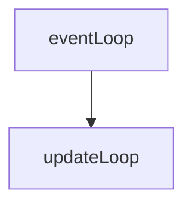

## chain_indexer blockchain index

chain_indexer.go code analysis

Chain_indexer, as its name implies, is used to create an index for a blockchain. In the eth protocol, It introduced the function of BloomIndexer. In fact, BloomIndexer is a special implementation of chain_indexer. It can be understood as a derived class. The main function is actually implemented in chain_indexer. Although it is a derived class, chain_indexer is actually only used by BloomIndexer. That is, an index is created for the Bloom filter of the blockchain to quickly respond to the user's log search function. Let's analyze the code in this section.

### data structure

```go
// ChainIndexerBackend defines the methods needed to process chain segments in
// the background and write the segment results into the database. These can be
// used to create filter blooms or CHTs.
type ChainIndexerBackend interface {
	// Reset initiates the processing of a new chain segment, potentially terminating
	// any partially completed operations (in case of a reorg).
	Reset(section uint64)

	// Process crunches through the next header in the chain segment. The caller
	// will ensure a sequential order of headers.
	Process(header *types.Header)

	// Commit finalizes the section metadata and stores it into the database.
	Commit() error
}

// ChainIndexer does a post-processing job for equally sized sections of the
// canonical chain (like BlooomBits and CHT structures). A ChainIndexer is
// connected to the blockchain through the event system by starting a
// ChainEventLoop in a goroutine.
// Further child ChainIndexers can be added which use the output of the parent
// section indexer. These child indexers receive new head notifications only
// after an entire section has been finished or in case of rollbacks that might
// affect already finished sections.
type ChainIndexer struct {
	chainDb  ethdb.Database      // Chain database to index the data from the database where the blockchain is located
	indexDb  ethdb.Database      // Prefixed table-view of the db to write index metadata into indexed store
	backend  ChainIndexerBackend // Background processor generating the index data content
	children []*ChainIndexer     // Child indexers to cascade chain updates to subindex

	active uint32          // Flag whether the event loop was started
	update chan struct{}   // Notification channel that headers should be processed
	quit   chan chan error // Quit channel to tear down running goroutines

	sectionSize uint64 // Number of blocks in a single chain segment to process	section
	confirmsReq uint64 // Number of confirmations before processing a completed segment

	storedSections uint64 // Number of sections successfully indexed into the database
	knownSections  uint64 // Number of sections known to be complete (block wise)
	cascadedHead   uint64 // Block number of the last completed section cascaded to subindexers

	throttling time.Duration // Disk throttling to prevent a heavy upgrade from hogging resources(unresponsive)

	log  log.Logger
	lock sync.RWMutex
}
```

NewChainIndexer contructor

```go
// this method is called inside eth/bloombits.go
const (
	// bloomConfirms is the number of confirmation blocks before a bloom section is
	// considered probably final and its rotated bits are calculated.
	// bloomConfirms This method is called in eth/bloombits.go to indicate the number of blocks, indicating that after so many blocks, the bloom section is considered to have not changed.
	bloomConfirms = 256

	// bloomThrottling is the time to wait between processing two consecutive index
	// sections. It's useful during chain upgrades to prevent disk overload.
	// bloomThrottling: It is useful to prevent disk overload during blockchain upgrades.
	bloomThrottling = 100 * time.Millisecond
)

func NewBloomIndexer(db ethdb.Database, size uint64) *core.ChainIndexer {
	backend := &BloomIndexer{
		db:   db,
		size: size,
	}
	// You can see that indexDb and chainDb are actually the same database, but each key of indexDb is prefixed with a BloomBitsIndexPrefix.
	table := ethdb.NewTable(db, string(core.BloomBitsIndexPrefix))

	return core.NewChainIndexer(db, table, backend, size, bloomConfirms, bloomThrottling, "bloombits")
}


// NewChainIndexer creates a new chain indexer to do background processing on
// chain segments of a given size after certain number of confirmations passed.
// The throttling parameter might be used to prevent database thrashing.

func NewChainIndexer(chainDb, indexDb ethdb.Database, backend ChainIndexerBackend, section, confirm uint64, throttling time.Duration, kind string) *ChainIndexer {
	c := &ChainIndexer{
		chainDb:     chainDb,
		indexDb:     indexDb,
		backend:     backend,
		update:      make(chan struct{}, 1),
		quit:        make(chan chan error),
		sectionSize: section,
		confirmsReq: confirm,
		throttling:  throttling,
		log:         log.New("type", kind),
	}
	// Initialize database dependent fields and start the updater
	c.loadValidSections()
	go c.updateLoop()

	return c
}
```

loadValidSections, used to load our previous processing information from the database, storedSections indicates where we have processed.

```go
// loadValidSections reads the number of valid sections from the index database
// and caches is into the local state.
func (c *ChainIndexer) loadValidSections() {
	data, _ := c.indexDb.Get([]byte("count"))
	if len(data) == 8 {
		c.storedSections = binary.BigEndian.Uint64(data[:])
	}
}
```

updateLoop, the main event loop, is used to call backend to handle the blockchain section. It should be noted that all the main index nodes and all child indexers will start the goroutine method.

```go
func (c *ChainIndexer) updateLoop() {
	var (
		updating bool
		updated  time.Time
	)
	for {
		select {
		case errc := <-c.quit:
			// Chain indexer terminating, report no failure and abort
			errc <- nil
			return

		case <-c.update:  // When you need to use backend processing, other goroutine will send messages to this channel)
			// Section headers completed (or rolled back), update the index
			c.lock.Lock()
			if c.knownSections > c.storedSections { // If the currently known Section is larger than the already stored Section
				// Periodically print an upgrade log message to the user
				// The log information is printed every 8 seconds.
				if time.Since(updated) > 8*time.Second {
					if c.knownSections > c.storedSections+1 {
						updating = true
						c.log.Info("Upgrading chain index", "percentage", c.storedSections*100/c.knownSections)
					}
					updated = time.Now()
				}
				// Cache the current section count and head to allow unlocking the mutex
				section := c.storedSections
				var oldHead common.Hash
				if section > 0 { // section - 1
					// sectionHead is used to get the hash value of the last block of the section.
					oldHead = c.sectionHead(section - 1)
				}
				// Process the newly defined section in the background
				c.lock.Unlock()
				newHead, err := c.processSection(section, oldHead)
				if err != nil {
					c.log.Error("Section processing failed", "error", err)
				}
				c.lock.Lock()

				// If processing succeeded and no reorgs occcurred, mark the section completed
				if err == nil && oldHead == c.sectionHead(section-1) {
					c.setSectionHead(section, newHead) // Update the status of the database
					c.setValidSections(section + 1)    // Update the database status
					if c.storedSections == c.knownSections && updating {
						updating = false
						c.log.Info("Finished upgrading chain index")
					}
					// cascadedHead: Is the height of the last block of the updated section
					c.cascadedHead = c.storedSections*c.sectionSize - 1
					for _, child := range c.children {
						c.log.Trace("Cascading chain index update", "head", c.cascadedHead)
						child.newHead(c.cascadedHead, false)
					}
				} else {
					// If processing failed, don't retry until further notification
					c.log.Debug("Chain index processing failed", "section", section, "err", err)
					c.knownSections = c.storedSections
				}
			}
			// If there are still further sections to process, reschedule
			if c.knownSections > c.storedSections {
				time.AfterFunc(c.throttling, func() {
					select {
					case c.update <- struct{}{}:
					default:
					}
				})
			}
			c.lock.Unlock()
		}
	}
}
```

Start method. This method is called when the eth protocol is started. This method receives two parameters, one is the current block header, and the other is the event subscriber, through which the blockchain change information can be obtained.

```go
eth.bloomIndexer.Start(eth.blockchain.CurrentHeader(), eth.blockchain.SubscribeChainEvent)

// Start creates a goroutine to feed chain head events into the indexer for
// cascading background processing. Children do not need to be started, they
// are notified about new events by their parents.

// The subchain does not need to be activated.
func (c *ChainIndexer) Start(currentHeader *types.Header, chainEventer func(ch chan<- ChainEvent) event.Subscription) {
	go c.eventLoop(currentHeader, chainEventer)
}

// eventLoop is a secondary - optional - event loop of the indexer which is only
// started for the outermost indexer to push chain head events into a processing
// queue.

func (c *ChainIndexer) eventLoop(currentHeader *types.Header, chainEventer func(ch chan<- ChainEvent) event.Subscription) {
	// Mark the chain indexer as active, requiring an additional teardown
	atomic.StoreUint32(&c.active, 1)

	events := make(chan ChainEvent, 10)
	sub := chainEventer(events)
	defer sub.Unsubscribe()

	// Fire the initial new head event to start any outstanding processing
	c.newHead(currentHeader.Number.Uint64(), false)

	var (
		prevHeader = currentHeader
		prevHash   = currentHeader.Hash()
	)
	for {
		select {
		case errc := <-c.quit:
			// Chain indexer terminating, report no failure and abort
			errc <- nil
			return

		case ev, ok := <-events:
			// Received a new event, ensure it's not nil (closing) and update
			if !ok {
				errc := <-c.quit
				errc <- nil
				return
			}
			header := ev.Block.Header()
			if header.ParentHash != prevHash { // if there is a fork
				// Find the common ancestor, the index from the common ancestor needs to be largest
				c.newHead(FindCommonAncestor(c.chainDb, prevHeader, header).Number.Uint64(), true)
			}
			// Set a new head
			c.newHead(header.Number.Uint64(), false)

			prevHeader, prevHash = header, header.Hash()
		}
	}
}
```

The newHead method notifies the indexer of the new blockchain header, or needs to rebuild the index, the newHead method will trigger

```go
// newHead notifies the indexer about new chain heads and/or reorgs.
func (c *ChainIndexer) newHead(head uint64, reorg bool) {
	c.lock.Lock()
	defer c.lock.Unlock()

	// If a reorg happened, invalidate all sections until that point
	if reorg { // Need to rebuild the index, all sections starting from head need to be rebuilt.
		// Revert the known section number to the reorg point
		changed := head / c.sectionSize
		if changed < c.knownSections {
			c.knownSections = changed
		}
		// Revert the stored sections from the database to the reorg point
		if changed < c.storedSections {
			c.setValidSections(changed)
		}
		// Update the new head number to te finalized section end and notify children
		head = changed * c.sectionSize

		if head < c.cascadedHead {
			c.cascadedHead = head
			for _, child := range c.children {
				child.newHead(c.cascadedHead, true)
			}
		}
		return
	}
	// No reorg, calculate the number of newly known sections and update if high enough
	var sections uint64
	if head >= c.confirmsReq {
		sections = (head + 1 - c.confirmsReq) / c.sectionSize
		if sections > c.knownSections {
			c.knownSections = sections

			select {
			case c.update <- struct{}{}:
			default:
			}
		}
	}
}
```

The relationship between the parent and child index data is monitored by the parent Indexer load event and then the result is passed to the updateLoop of the child Indexer via newHead.



The setValidSections method writes the number of sections that are currently stored. If the value passed in is less than the amount already stored, delete the corresponding section from the database.

```go
// setValidSections writes the number of valid sections to the index database
func (c *ChainIndexer) setValidSections(sections uint64) {
	// Set the current number of valid sections in the database
	var data [8]byte
	binary.BigEndian.PutUint64(data[:], sections)
	c.indexDb.Put([]byte("count"), data[:])

	// Remove any reorged sections, caching the valids in the mean time
	for c.storedSections > sections {
		c.storedSections--
		c.removeSectionHead(c.storedSections)
	}
	c.storedSections = sections // needed if new > old
}
```

processSection

```go
// processSection processes an entire section by calling backend functions while
// ensuring the continuity of the passed headers. Since the chain mutex is not
// held while processing, the continuity can be broken by a long reorg, in which
// case the function returns with an error.
func (c *ChainIndexer) processSection(section uint64, lastHead common.Hash) (common.Hash, error) {
	c.log.Trace("Processing new chain section", "section", section)

	// Reset and partial processing
	c.backend.Reset(section)
	// process all canonical in one section, GetCanonicalHash: retrieves the hash assigned to a canonical block number.
	for number := section * c.sectionSize; number < (section+1)*c.sectionSize; number++ {
		hash := GetCanonicalHash(c.chainDb, number)
		if hash == (common.Hash{}) {
			return common.Hash{}, fmt.Errorf("canonical block #%d unknown", number)
		}
		header := GetHeader(c.chainDb, hash, number)
		if header == nil {
			return common.Hash{}, fmt.Errorf("block #%d [%x…] not found", number, hash[:4])
		} else if header.ParentHash != lastHead {
			return common.Hash{}, fmt.Errorf("chain reorged during section processing")
		}
		c.backend.Process(header)
		lastHead = header.Hash()
	}
	if err := c.backend.Commit(); err != nil {
		c.log.Error("Section commit failed", "error", err)
		return common.Hash{}, err
	}
	return lastHead, nil
}
```
