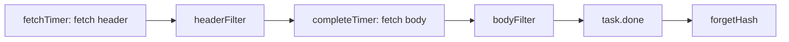

Fetcher contains synchronization based on block notifications. When we received the NewBlockHashesMsg message, we only received a lot of Block hash values. The hash value needs to be used to synchronize the block and then update the local blockchain. Fetcher provides such a feature.
The same thing happens with swarm when we want to build a decentralized storage, each chunk corresponding to a hash. If we use swarm feed, we will deliver message directly so that the subscriber can check feed topic for update

data structure

```go
// announce is the hash notification of the availability of a new block in the
// network.
type announce struct {
	hash   common.Hash   // Hash of the block being announced
	number uint64        // Number of the block being announced (0 = unknown | old protocol)
	header *types.Header // Header of the block partially reassembled (new protocol)
	time   time.Time     // Timestamp of the announcement

	origin string // Identifier of the peer originating the notification

	fetchHeader headerRequesterFn // Fetcher function to retrieve the header of an announced block
	fetchBodies bodyRequesterFn   // Fetcher function to retrieve the body of an announced block
}

// headerFilterTask represents a batch of headers needing fetcher filtering.
type headerFilterTask struct {
	peer    string          // The source peer of block headers
	headers []*types.Header // Collection of headers to filter
	time    time.Time       // Arrival time of the headers
}

// headerFilterTask represents a batch of block bodies (transactions and uncles)
// needing fetcher filtering.
type bodyFilterTask struct {
	peer         string                 // The source peer of block bodies
	transactions [][]*types.Transaction // Collection of transactions per block bodies
	uncles       [][]*types.Header      // Collection of uncles per block bodies
	time         time.Time              // Arrival time of the blocks' contents
}

// inject represents a schedules import operation.
type inject struct {
	origin string
	block  *types.Block
}

// Fetcher is responsible for accumulating block announcements from various peers
// and scheduling them for retrieval.
type Fetcher struct {
	// Various event channels
	notify chan *announce	//announce
	inject chan *inject		//inject

	blockFilter  chan chan []*types.Block	 // channel of channels
	headerFilter chan chan *headerFilterTask
	bodyFilter   chan chan *bodyFilterTask

	done chan common.Hash
	quit chan struct{}

	// Announce states
	announces  map[string]int              // Per peer announce counts to prevent memory exhaustion. Key is the name of the peer, and value is the count of announce, in order to avoid memory usage is too large.
	announced  map[common.Hash][]*announce // Announced blocks, scheduled for fetching
	fetching   map[common.Hash]*announce   // Announced blocks, currently fetching
	fetched    map[common.Hash][]*announce // Blocks with headers fetched, scheduled for body retrieval
	completing map[common.Hash]*announce   // Blocks with headers, currently body-completing

	// Block cache
	queue  *prque.Prque            // Queue containing the import operations (block number sorted), priority queue
	queues map[string]int          // Per peer block counts to prevent memory exhaustion. Key is peer and value is the number of blocks.
	queued map[common.Hash]*inject // Set of already queued blocks (to dedup imports)

	// Callbacks
	getBlock       blockRetrievalFn   // Retrieves a block from the local chain
	verifyHeader   headerVerifierFn   // Checks if a block's headers have a valid proof of work
	broadcastBlock blockBroadcasterFn // Broadcasts a block to connected peers
	chainHeight    chainHeightFn      // Retrieves the current chain's height
	insertChain    chainInsertFn      // Injects a batch of blocks into the chain
	dropPeer       peerDropFn         // Drops a peer for misbehaving

	// Testing hooks
	announceChangeHook func(common.Hash, bool) // Method to call upon adding or deleting a hash from the announce list
	queueChangeHook    func(common.Hash, bool) // Method to call upon adding or deleting a block from the import queue
	// New model syncing (PV62), consider reputation of the sending node
	fetchingHook       func([]common.Hash)     // Method to call upon starting a block (eth/61) or header (eth/62) fetch
	completingHook     func([]common.Hash)     // Method to call upon starting a block body fetch (eth/62)
	importedHook       func(*types.Block)      // Method to call upon successful block import (both eth/61 and eth/62)
}
```

Start fetcher and start a goroutine directly. This function is a bit long. Follow-up analysis.

```go
// Start boots up the announcement based synchroniser, accepting and processing
// hash notifications and block fetches until termination requested.
func (f *Fetcher) Start() {
	go f.loop()
}
```

The loop function is too long. I will post an ellipsis version first. Fetcher records the state of announce via four maps (announced, fetching, fetched, completing) (waiting for fetch, fetching, fetch waiting for fetch body, fetch is done). The loop actually uses a timer and various messages to perform state transitions on the announcements in various maps.

```go
// Loop is the main fetcher loop, checking and processing various notification
// events.
func (f *Fetcher) loop() {
	// Iterate the block fetching until a quit is requested
	fetchTimer := time.NewTimer(0)
	completeTimer := time.NewTimer(0)

	for {
		// Clean up any expired block fetches
		for hash, announce := range f.fetching {
			if time.Since(announce.time) > fetchTimeout {
				f.forgetHash(hash)
			}
		}
		// Import any queued blocks that could potentially fit
		// This fetcher.queue caches the blocks that have completed fetch and waits to insert them into the local blockchain in order.
		height := f.chainHeight()
		for !f.queue.Empty() { //
			op := f.queue.PopItem().(*inject)
			if f.queueChangeHook != nil {
				f.queueChangeHook(op.block.Hash(), false)
			}
			// If too high up the chain or phase, continue later
			number := op.block.NumberU64()
			if number > height+1 { // to high, can not import this time
				f.queue.Push(op, -float32(op.block.NumberU64()))
				if f.queueChangeHook != nil {
					f.queueChangeHook(op.block.Hash(), true)
				}
				break
			}
			// Otherwise if fresh and still unknown, try and import
			hash := op.block.Hash()
			if number+maxUncleDist < height || f.getBlock(hash) != nil {
				// The height of the block is too low. Below the current height-maxUncleDist
				// or the block has been imported before
				f.forgetBlock(hash)
				continue
			}
			// insert it
			f.insert(op.origin, op.block)
		}
		// Wait for an outside event to occur
		select {
		case <-f.quit:
			// Fetcher terminating, abort all operations
			return

		case notification := <-f.notify: // When NewBlockHashesMsg is received, the hash value of the block that is not yet in the local blockchain will be sent to the notify channel by calling the fetcher's Notify method.
			...

		case op := <-f.inject: // The Receiver Enqueue method is called when NewBlockMsg is received. This method will send the currently received block to the inject channel.
			...
			f.enqueue(op.origin, op.block)

		case hash := <-f.done: // When the import of a block is completed, the hash value of the block is sent to the done channel.
			...

		case <-fetchTimer.C: // fetchTimer timer, periodically fetch the block headers that need fetch
			...

		case <-completeTimer.C: // The completeTimer timer periodically fetches the block that needs fetch
			...

		case filter := <-f.headerFilter: // When a message from BlockHeadersMsg is received (some block headers are received), these messages are posted to the headerFilter queue. This will leave the data belonging to the fetcher request, and the rest will be returned for use by other systems.
			...

		case filter := <-f.bodyFilter: // When the BlockBodiesMsg message is received, these messages are delivered to the bodyFilter queue. This will leave the data belonging to the fetcher request, and the rest will be returned for use by other systems.
			...
		}
	}
}
```

### Block header filtering process

#### FilterHeaders request

The FilterHeaders method is called when a BlockHeadersMsg is received. This method first delivers a channel filter to the headerFilter. Then post a headerFilterTask task to the filter. Then block waiting for the filter queue to return a message.

```go
// FilterHeaders extracts all the headers that were explicitly requested by the fetcher,
// returning those that should be handled differently.
func (f *Fetcher) FilterHeaders(peer string, headers []*types.Header, time time.Time) []*types.Header {
	log.Trace("Filtering headers", "peer", peer, "headers", len(headers))

	// Send the filter channel to the fetcher
	filter := make(chan *headerFilterTask)

	select {
	case f.headerFilter <- filter:
	case <-f.quit:
		return nil
	}
	// Request the filtering of the header list
	select {
	case filter <- &headerFilterTask{peer: peer, headers: headers, time: time}:
	case <-f.quit:
		return nil
	}
	// Retrieve the headers remaining after filtering
	select {
	case task := <-filter:
		return task.headers
	case <-f.quit:
		return nil
	}
}
```

#### headerFilter processing

this is handled in the go routine of loop().

```go
case filter := <-f.headerFilter:
	// Headers arrived from a remote peer. Extract those that were explicitly
	// requested by the fetcher, and return everything else so it's delivered
	// to other parts of the system.
	var task *headerFilterTask
	select {
	case task = <-filter:
	case <-f.quit:
		return
	}
	headerFilterInMeter.Mark(int64(len(task.headers)))

	// Split the batch of headers into unknown ones (to return to the caller),
	// known incomplete ones (requiring body retrievals) and completed blocks.
	unknown, incomplete, complete := []*types.Header{}, []*announce{}, []*types.Block{}
	for _, header := range task.headers {
		hash := header.Hash()

		// Filter fetcher-requested headers from other synchronisation algorithms
		if announce := f.fetching[hash]; announce != nil && announce.origin == task.peer && f.fetched[hash] == nil && f.completing[hash] == nil && f.queued[hash] == nil {
			// If the delivered header does not match the promised number, drop the announcer
			if header.Number.Uint64() != announce.number {
				log.Trace("Invalid block number fetched", "peer", announce.origin, "hash", header.Hash(), "announced", announce.number, "provided", header.Number)
				f.dropPeer(announce.origin)
				f.forgetHash(hash)
				continue
			}
			// Only keep if not imported by other means
			if f.getBlock(hash) == nil {
				announce.header = header
				announce.time = task.time

				// If the block is empty (header only), short circuit into the final import queue
				if header.TxHash == types.DeriveSha(types.Transactions{}) && header.UncleHash == types.CalcUncleHash([]*types.Header{}) {
					log.Trace("Block empty, skipping body retrieval", "peer", announce.origin, "number", header.Number, "hash", header.Hash())

					block := types.NewBlockWithHeader(header)
					block.ReceivedAt = task.time

					complete = append(complete, block)
					f.completing[hash] = announce
					continue
				}
				// Otherwise add to the list of blocks needing completion
				incomplete = append(incomplete, announce)
			} else {
				log.Trace("Block already imported, discarding header", "peer", announce.origin, "number", header.Number, "hash", header.Hash())
				f.forgetHash(hash)
			}
		} else {
			// Fetcher doesn't know about it, add to the return list
			unknown = append(unknown, header)
		}
	}
	headerFilterOutMeter.Mark(int64(len(unknown)))
	select {
	case filter <- &headerFilterTask{headers: unknown, time: task.time}:
	case <-f.quit:
		return
	}
	// Schedule the retrieved headers for body completion
	for _, announce := range incomplete {
		hash := announce.header.Hash()
		if _, ok := f.completing[hash]; ok { // already done
			continue
		}
		// wait for map to be processed
		f.fetched[hash] = append(f.fetched[hash], announce)
		if len(f.fetched) == 1 { // If the fetched map has only one element that has just been added.
			f.rescheduleComplete(completeTimer)
		}
	}
	// Schedule the header-only blocks for import
	for _, block := range complete {
		if announce := f.completing[block.Hash()]; announce != nil {
			f.enqueue(announce.origin, block)
		}
	}
```

#### bodyFilter processing

Similar to the above processing.

```go
case filter := <-f.bodyFilter:
	// Block bodies arrived, extract any explicitly requested blocks, return the rest
	var task *bodyFilterTask
	select {
	case task = <-filter:
	case <-f.quit:
		return
	}
	bodyFilterInMeter.Mark(int64(len(task.transactions)))

	blocks := []*types.Block{}
	for i := 0; i < len(task.transactions) && i < len(task.uncles); i++ {
		// Match up a body to any possible completion request
		matched := false

		for hash, announce := range f.completing {
			if f.queued[hash] == nil {
				txnHash := types.DeriveSha(types.Transactions(task.transactions[i]))
				uncleHash := types.CalcUncleHash(task.uncles[i])

				if txnHash == announce.header.TxHash && uncleHash == announce.header.UncleHash && announce.origin == task.peer {
					// Mark the body matched, reassemble if still unknown
					matched = true

					if f.getBlock(hash) == nil {
						block := types.NewBlockWithHeader(announce.header).WithBody(task.transactions[i], task.uncles[i])
						block.ReceivedAt = task.time

						blocks = append(blocks, block)
					} else {
						f.forgetHash(hash)
					}
				}
			}
		}
		if matched {
			task.transactions = append(task.transactions[:i], task.transactions[i+1:]...)
			task.uncles = append(task.uncles[:i], task.uncles[i+1:]...)
			i--
			continue
		}
	}

	bodyFilterOutMeter.Mark(int64(len(task.transactions)))
	select {
	case filter <- task:
	case <-f.quit:
		return
	}
	// Schedule the retrieved blocks for ordered import
	for _, block := range blocks {
		if announce := f.completing[block.Hash()]; announce != nil {
			f.enqueue(announce.origin, block)
		}
	}
```

#### notification processing

When NewBlockHashesMsg is received, the hash value of the block that is not yet in the local blockchain will be sent to the notify channel by calling the fetcher's Notify method.

```go
// Notify announces the fetcher of the potential availability of a new block in
// the network.
func (f *Fetcher) Notify(peer string, hash common.Hash, number uint64, time time.Time,
	headerFetcher headerRequesterFn, bodyFetcher bodyRequesterFn) error {
	block := &announce{
		hash:        hash,
		number:      number,
		time:        time,
		origin:      peer,
		fetchHeader: headerFetcher,
		fetchBodies: bodyFetcher,
	}
	select {
	case f.notify <- block:
		return nil
	case <-f.quit:
		return errTerminated
	}
}
```

The processing in the loop, mainly to check and then joined the announced container waiting for timing processing.

```go
case notification := <-f.notify:
		// A block was announced, make sure the peer isn't DOSing us
		propAnnounceInMeter.Mark(1)

		count := f.announces[notification.origin] + 1
		if count > hashLimit {  //hashLimit 256
			log.Debug("Peer exceeded outstanding announces", "peer", notification.origin, "limit", hashLimit)
			propAnnounceDOSMeter.Mark(1)
			break
		}
		// If we have a valid block number, check that it's potentially useful
		if notification.number > 0 {
			if dist := int64(notification.number) - int64(f.chainHeight()); dist < -maxUncleDist || dist > maxQueueDist {
				log.Debug("Peer discarded announcement", "peer", notification.origin, "number", notification.number, "hash", notification.hash, "distance", dist)
				propAnnounceDropMeter.Mark(1)
				break
			}
		}
		// All is well, schedule the announce if block's not yet downloading
		if _, ok := f.fetching[notification.hash]; ok {
			break
		}
		if _, ok := f.completing[notification.hash]; ok {
			break
		}
		f.announces[notification.origin] = count
		f.announced[notification.hash] = append(f.announced[notification.hash], notification)
		if f.announceChangeHook != nil && len(f.announced[notification.hash]) == 1 {
			f.announceChangeHook(notification.hash, true)
		}
		if len(f.announced) == 1 {
			f.rescheduleFetch(fetchTimer)
		}
```

#### Enqueue processing

The Receiver Enqueue method is called when NewBlockMsg is received. This method will send the currently received block to the inject channel. You can see that this method generates an inject object and sends it to the inject channel.

```go
// Enqueue tries to fill gaps the the fetcher's future import queue.
func (f *Fetcher) Enqueue(peer string, block *types.Block) error {
	op := &inject{
		origin: peer,
		block:  block,
	}
	select {
	case f.inject <- op:
		return nil
	case <-f.quit:
		return errTerminated
	}
}
```

Inject channel processing is very simple, directly join the queue to wait for import

```go
case op := <-f.inject:
		// A direct block insertion was requested, try and fill any pending gaps
		propBroadcastInMeter.Mark(1)
		f.enqueue(op.origin, op.block)
```

enqueue

```go
// enqueue schedules a new future import operation, if the block to be imported
// has not yet been seen.
func (f *Fetcher) enqueue(peer string, block *types.Block) {
	hash := block.Hash()

	// Ensure the peer isn't DOSing us
	count := f.queues[peer] + 1
	if count > blockLimit { // blockLimit 64
		log.Debug("Discarded propagated block, exceeded allowance", "peer", peer, "number", block.Number(), "hash", hash, "limit", blockLimit)
		propBroadcastDOSMeter.Mark(1)
		f.forgetHash(hash)
		return
	}
	// Discard any past or too distant blocks
	if dist := int64(block.NumberU64()) - int64(f.chainHeight()); dist < -maxUncleDist || dist > maxQueueDist {
		log.Debug("Discarded propagated block, too far away", "peer", peer, "number", block.Number(), "hash", hash, "distance", dist)
		propBroadcastDropMeter.Mark(1)
		f.forgetHash(hash)
		return
	}
	// Schedule the block for future importing
	if _, ok := f.queued[hash]; !ok {
		op := &inject{
			origin: peer,
			block:  block,
		}
		f.queues[peer] = count
		f.queued[hash] = op
		f.queue.Push(op, -float32(block.NumberU64()))
		if f.queueChangeHook != nil {
			f.queueChangeHook(op.block.Hash(), true)
		}
		log.Debug("Queued propagated block", "peer", peer, "number", block.Number(), "hash", hash, "queued", f.queue.Size())
	}
}
```

#### timer processing

There are two timers in total. fetchTimer and completeTimer are responsible for getting the block header and getting the block body respectively.



Found a problem. The completed container may leak. If a body request for a hash is sent. But the request failed and the other party did not return. At this time the completing container was not cleaned up. Is it possible to cause problems?

```go
case <-fetchTimer.C:
	// At least one block's timer ran out, check for needing retrieval
	request := make(map[string][]common.Hash)

	for hash, announces := range f.announced {
		// time limit
		// The earliest received announcement and passed the arriveTimeout-gatherSlack for such a long time.
		if time.Since(announces[0].time) > arriveTimeout-gatherSlack {
			// Pick a random peer to retrieve from, reset all others
			announce := announces[rand.Intn(len(announces))]
			f.forgetHash(hash)

			// If the block still didn't arrive, queue for fetching
			if f.getBlock(hash) == nil {
				request[announce.origin] = append(request[announce.origin], hash)
				f.fetching[hash] = announce
			}
		}
	}
	// Send out all block header requests
	for peer, hashes := range request {
		log.Trace("Fetching scheduled headers", "peer", peer, "list", hashes)

		// Create a closure of the fetch and schedule in on a new thread
		fetchHeader, hashes := f.fetching[hashes[0]].fetchHeader, hashes
		go func() {
			if f.fetchingHook != nil {
				f.fetchingHook(hashes)
			}
			for _, hash := range hashes {
				headerFetchMeter.Mark(1)
				fetchHeader(hash) // Suboptimal, but protocol doesn't allow batch header retrievals
			}
		}()
	}
	// Schedule the next fetch if blocks are still pending
	f.rescheduleFetch(fetchTimer)

case <-completeTimer.C:
	// At least one header's timer ran out, retrieve everything
	request := make(map[string][]common.Hash)

	for hash, announces := range f.fetched {
		// Pick a random peer to retrieve from, reset all others
		announce := announces[rand.Intn(len(announces))]
		f.forgetHash(hash)

		// If the block still didn't arrive, queue for completion
		if f.getBlock(hash) == nil {
			request[announce.origin] = append(request[announce.origin], hash)
			f.completing[hash] = announce
		}
	}
	// Send out all block body requests
	for peer, hashes := range request {
		log.Trace("Fetching scheduled bodies", "peer", peer, "list", hashes)

		// Create a closure of the fetch and schedule in on a new thread
		if f.completingHook != nil {
			f.completingHook(hashes)
		}
		bodyFetchMeter.Mark(int64(len(hashes)))
		go f.completing[hashes[0]].fetchBodies(hashes)
	}
	// Schedule the next fetch if blocks are still pending
	f.rescheduleComplete(completeTimer)
```

#### Some other methods

Fetcher insert method. This method inserts the given block into the local blockchain.

```go
// insert spawns a new goroutine to run a block insertion into the chain. If the
// block's number is at the same height as the current import phase, if updates
// the phase states accordingly.
func (f *Fetcher) insert(peer string, block *types.Block) {
	hash := block.Hash()

	// Run the import on a new thread
	log.Debug("Importing propagated block", "peer", peer, "number", block.Number(), "hash", hash)
	go func() {
		defer func() { f.done <- hash }()

		// If the parent's unknown, abort insertion
		parent := f.getBlock(block.ParentHash())
		if parent == nil {
			log.Debug("Unknown parent of propagated block", "peer", peer, "number", block.Number(), "hash", hash, "parent", block.ParentHash())
			return
		}
		// Quickly validate the header and propagate the block if it passes
		switch err := f.verifyHeader(block.Header()); err {
		case nil:
			// All ok, quickly propagate to our peers that we have just received a valid block
			propBroadcastOutTimer.UpdateSince(block.ReceivedAt)
			go f.broadcastBlock(block, true)

		case consensus.ErrFutureBlock:
			// Weird future block, don't fail, but neither propagate

		default:
			// Something went very wrong, drop the peer
			log.Debug("Propagated block verification failed", "peer", peer, "number", block.Number(), "hash", hash, "err", err)
			f.dropPeer(peer)
			return
		}
		// Run the actual import and log any issues
		if _, err := f.insertChain(types.Blocks{block}); err != nil {
			log.Debug("Propagated block import failed", "peer", peer, "number", block.Number(), "hash", hash, "err", err)
			return
		}
		// If import succeeded, broadcast the block
		// If the insertion is successful, then the broadcast block, the second parameter is false. Then only the hash of the block will be broadcast.
		propAnnounceOutTimer.UpdateSince(block.ReceivedAt)
		go f.broadcastBlock(block, false)

		// Invoke the testing hook if needed
		if f.importedHook != nil {
			f.importedHook(block)
		}
	}()
}
```
