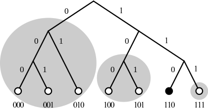

## Swarm storage introduction

**Swarm defines 3 crucial notions:**

1. chunk
   - Chunks are pieces of data of limited size (max 4K)
2. reference
   - A reference is a unique identifier - cryptography hash of the data
3. manifest
   - A manifest is a data structure describing file collections

**Kademlia topology**  
Swarm use the ethereum devp2p rlpx suite as the transport layer of the underlay network. This allows semi-stable peer connections over TCP with authenticated, encrypted, synchronous data streams.  
In a graph with kademlia topology, a path between any two points exists, it can be found using only local decisions on each hop and is guaranteed to terminate in no more steps than the depth of the destination plus one.


this distributed hash table stores resource locations throughout the network

it calculates the distance to build the depth.
Exclusive or was chosen because it acts as a distance function between all the node IDs. Specifically:

- the distance between a node and itself is zero
- it is symmetric: the "distances" calculated from A to B and from B to A are the same
- it follows the triangle inequality: given A, B and C are vertices (points) of a triangle, then the distance from A to B is shorter than (or equal to) the sum of the distance from A to C plus the distance from C to B.

Each bit of the node ID refer to a list, every entry in a list holds the neccessary data to locate another node(IP, port, nodeID)
Every list corresponds to a specific distance from the node. Nodes that can go in the n<sup>th</sup> list must have a differing n<sup>th</sup> bit from the node's ID; the first n-1 bits of the candidate ID must match those of the node's ID. This means that it is very easy to populate the first list as 1/2 of the nodes in the network are far away candidates. The next list can use only 1/4 of the nodes in the network (one bit closer than the first), etc.


If a node wants to share a file, it processes the contents of the file, calculating from it a number (hash) that will identify this file within the file-sharing network.
The hashes and the node IDs must be of the same length. It then searches for several nodes whose ID is close to the hash, and has its own IP address stored at those nodes. i.e. it publishes itself as a source for this file. A searching client will use Kademlia to search the network for the node whose ID has the smallest distance to the file hash, then will retrieve the sources list that is stored in that node.

**Distributed preimage archive**  
Distributed hash tables (DHTs) utilise an overlay network to implement a key-value store distributed over the nodes. The basic idea is that the keyspace is mapped onto the overlay address space, and information about an element in the container is to be found with nodes whose address is in the proximity of the key. DHTs for decentralised content addressed storage typically associate content fingerprints with a list of nodes (seeders) who can serve that content. However, the same structure can be used directly: it is not information about the location of content that is stored at the node closest to the address (fingerprint), but the content itself. We call this structure distributed preimage archive (DPA).


**Replicas hold by a set of nearest neighbours**  
A chunk is said to be redundantly retrievable of degree n if it is retrievable and would remain so after any n-1 responsible nodes leave the network. In the case of request forwarding failures, one can retry, or start concurrent retrieve requests.
The area of the fully connected neighbourhood defines an area of responsibility. A storer node is responsible for (storing) a chunk if the chunk falls within the node’s area of responsibility. As long as these assumptions hold, each chunk is retrievable even if R−1 storer nodes drop offline simultaneously. Erasure code is implemented also.

**Caching and purging Storage**  
 Since the Swarm has an address-key based retrieval protocol, content will be twice as likely be requested from a node that is one bit (one proximity bin) closer to the content’s address.
What a node stores is determined by the access count of chunks: if we reach the capacity limit for storage the oldest unaccessed chunks are removed. On the one hand, this is backed by an incentive system rewarding serving chunks.

**Synchronisation**  
In order to reduce network traffic resulting from receiving chunks from multiple sources, all store requests can go via a confirmation roundtrip. For each peer connection in both directions, the source peer sends an offeredHashes message containing a batch of hashes offered to push to the recipient. Recipient responds with a wantedHashes.


**Data layer**  
There are 4 different layers of data units relevant to Swarm:

- message: p2p RLPx network layer. Messages are relevant for the devp2p wire protocols The BZZ URL schemes.
- chunk: fixed size data unit of storage in the distributed preimage archive
- file: the smallest unit that is associated with a mime-type and not guaranteed to have integrity unless it is complete. This is the smallest unit semantic to the user, basically a file on a filesystem.
- collection: a mapping of paths to files is represented by the swarm manifest. This layer has a mapping to file system directory tree. Given trivial routing conventions, a url can be mapped to files in a standardised way, allowing manifests to mimic site maps/routing tables. As a result, Swarm is able to act as a webserver, a virtual cloud hosting service.

The actual storage layer of Swarm consists of two main components, the localstore and the netstore. The local store consists of an in-memory fast cache (memory store) and a persistent disk storage (dbstore). The NetStore is extending local store to a distributed storage of Swarm and implements the distributed preimage archive (DPA).


**Pss**  
pss (Postal Service over Swarm) is a messaging protocol utilizing whisper protocol over Swarm with strong privacy features.
With pss you can send messages to any node in the Swarm network. The messages are routed in the same manner as retrieve requests for chunks. Instead of chunk hash reference, pss messages specify a destination in the overlay address space independently of the message payload. This destination can describe a specific node if it is a complete overlay address or a neighbourhood if it is partially specified one. Up to the destination, the message is relayed through devp2p peer connections using forwarding kademlia (passing messages via semi-permanent peer-to-peer TCP connections between relaying nodes using kademlia routing). Within the destination neighbourhood the message is broadcast using gossip.
By default message is encrypted, but we can enable Raw sending.

**Feed**  
Since Swarm hashes are content addressed, changes to data will constantly result in changing hashes. Swarm Feeds provide a way to easily overcome this problem and provide a single, persistent, identifier to follow sequential data.
You can think of a Feed as a user’s Twitter account, where he/she posts updates about a particular Topic. In fact, the Feed object is simply defined as:

```go
type Feed struct {
  Topic Topic
  User  common.Address
}
```

Users can post to any topic. If you know the user’s address and agree on a particular Topic, you can then effectively “follow” that user’s Feed.

For convenience, feed.NewTopic() provides a way to “merge” a byte array with a string in order to build a Feed Topic out of both. This is used at the API level to create the illusion of subtopics. This way of building topics allows to use a random byte array (for example the hash of a smartcontract address) and merge it with a human-readable string such as "photo_id" in order to create a Topic that could represent the photo about that particular feed. This way, when you have a new photo, you could immediately build a Topic out of it and see if some user posted comments about that photo.  
Feeds are not created, only updated. If a particular Feed (user, topic combination) has never posted to, trying to fetch updates will yield nothing.  
`POST /bzz-feed:/?topic=<TOPIC>&user=<USER>&level=<LEVEL>&time=<TIME>&signature=<SIGNATURE>`

Where:

- topic: Feed topic, as specified above
- user: your Ethereum address
- level: Suggested frequency level retrieved in the JSON above
- time: Suggested timestamp retrieved in the JSON above
- protocolVersion: Feeds protocol version. Currently 0
- signature: Signature, hex encoded.
- Request posted data: binary stream with the update data, max 4K
