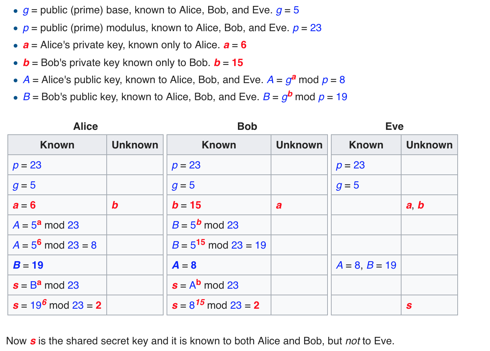

RLPx Encryption (RLPx encryption)

The discovery node discovery protocol introduced earlier, because the data carried is not very important, basically the plaintext transmission.

Each node will open two identical ports, one for UDP port and one for TCP discovery, which is used to carry service data. The port number of the UDP port is the same as the port number of the TCP port. In this way, as long as the port is discovered through UDP, it is equivalent to using TCP to connect to the corresponding port.

The RLPx protocol defines the encryption process for TCP links.

RLPx uses (Perfect Forward Secrecy), in simple terms. The two sides of the link generate a random private key, and the public key is obtained by a random private key. The two parties then exchange their respective public keys so that both parties can generate a shared key (shared-secret) by their own random private key and the other party's public key. Subsequent communications use this shared key as the key to the symmetric encryption algorithm. In this way. If one day's private key is leaked, it will only affect the security of the message after the leak. It is safe for the previous communication (because the communication key is randomly generated and disappears after use).

## Forward security (cited from Wikipedia)

Forward security or forward secrecy (English: Forward Secrecy, abbreviation: FS), sometimes referred to as Perfect Forward Secrecy (PFS), is the security of communication protocols in cryptography. Attributes refer to long-term use of master key leaks that do not cause past session key leaks. Forward security protects communications that were conducted in the past without the threat of passwords or keys being exposed in the future. If the system has forward security, it can guarantee that if the password or key is accidentally leaked at a certain moment, the communication that has been carried out in the past is still safe and will not be affected, even if the system is actively attacked. in this way.

### Diffie-Hellman key exchange

Diffie-Hellman key exchange (DH) is a security protocol. It allows the parties to create a key over an insecure channel without any prior information from the other party. This key can be used as a symmetric key to encrypt the communication content in subsequent communications. The concept of public key exchange was first proposed by Ralph C. Merkle, and this key exchange method was developed by Bailey Whitfield Diffie and Martin Edward Hellman. First published in 1976. Martin Herman once argued that this key exchange method should be called Diffie–Hellman–Merkle key exchange.

Synonyms for Diffie-Hellman key exchange include:

- Diffie-Hellman key agreement
- Diffie-Hellman key creation
- Index key exchange
- Diffie-Herman Agreement

Although the Diffie-Hellman key exchange itself is an anonymous (non-authenticated) key exchange protocol, it is the basis of many authentication protocols and is used to provide a complete pre-transmission mode in the transport layer security protocol. To safety.

#### description

Diffie-Herman exchanges a message over the common channel to create a shared secret that can be used for secure communication over the common channel. The following explains its process (including the mathematical part of the algorithm):


The simplest, the earliest proposed protocol uses an integer modulo n multiplicative group of prime numbers p and its original root g. The algorithm is shown below, green for non-secret information, red for bold for secret information:



## P2p/rlpx.go source code interpretation

This file implements the link protocol for RLPx.

The general process of link contact is as follows:

1. doEncHandshake() This method is used to complete the process of exchanging keys and creating encrypted channels. If it fails, the link is closed.
2. doProtoHandshake() This method is used to negotiate between protocol features, such as the protocol version of both parties, whether to support the Snappy encryption method.

After the link has been processed twice, it is built up. Because TCP is a streaming protocol. All RLPx protocols define the way framing is done. All data can be understood as one after another rlpxFrame. Rlpx reads and writes are handled by the rlpxFrameRW object.

### doEncHandshake

The originator of the link is called the initiator. The passive recipient of the link is called a receiver. The process of processing in these two modes is different. After completing the handshake. Generated a sec. It can be understood as a key that gets symmetric encryption. Then a newRLPXFrameRW frame reader was created. Complete the process of creating an encrypted channel.

```go
func (t *rlpx) doEncHandshake(prv *ecdsa.PrivateKey, dial *discover.Node) (discover.NodeID, error) {
	var (
		sec secrets
		err error
	)
	if dial == nil {
		sec, err = receiverEncHandshake(t.fd, prv, nil)
	} else {
		sec, err = initiatorEncHandshake(t.fd, prv, dial.ID, nil)
	}
	if err != nil {
		return discover.NodeID{}, err
	}
	t.wmu.Lock()
	t.rw = newRLPXFrameRW(t.fd, sec)
	t.wmu.Unlock()
	return sec.RemoteID, nil
}
```

The initiatorEncHandshake first looks at the operation of the originator of the link. First created authMsg with makeAuthMsg. Then send it to the peer through the network. Then read the response from the peer through readHandshakeMsg. Finally, the secrets are created by calling secrets.

```go
// initiatorEncHandshake negotiates a session token on conn.
// it should be called on the dialing side of the connection.
//
// prv is the local client's private key.
func initiatorEncHandshake(conn io.ReadWriter, prv *ecdsa.PrivateKey, remoteID discover.NodeID, token []byte) (s secrets, err error) {
	h := &encHandshake{initiator: true, remoteID: remoteID}
	authMsg, err := h.makeAuthMsg(prv, token)
	if err != nil {
		return s, err
	}
	authPacket, err := sealEIP8(authMsg, h)
	if err != nil {
		return s, err
	}
	if _, err = conn.Write(authPacket); err != nil {
		return s, err
	}

	authRespMsg := new(authRespV4)
	authRespPacket, err := readHandshakeMsg(authRespMsg, encAuthRespLen, prv, conn)
	if err != nil {
		return s, err
	}
	if err := h.handleAuthResp(authRespMsg); err != nil {
		return s, err
	}
	return h.secrets(authPacket, authRespPacket)
}
```

makeAuthMsg. This method creates the handshake message of the initiator. First, the public key of the peer can be obtained through the ID of the peer. So the public key of the peer is known to the person who initiated the connection. But for the connected person, the public key of the peer should be unknown.

```go
// makeAuthMsg creates the initiator handshake message.
func (h *encHandshake) makeAuthMsg(prv *ecdsa.PrivateKey, token []byte) (*authMsgV4, error) {
	rpub, err := h.remoteID.Pubkey()
	if err != nil {
		return nil, fmt.Errorf("bad remoteID: %v", err)
	}
	h.remotePub = ecies.ImportECDSAPublic(rpub)
	// Generate random initiator nonce.
	// Is a random initial value generated to avoid replay attacks? Or to avoid guessing keys through multiple connections?
	h.initNonce = make([]byte, shaLen)
	if _, err := rand.Read(h.initNonce); err != nil {
		return nil, err
	}
	// Generate random keypair to for ECDH.
	h.randomPrivKey, err = ecies.GenerateKey(rand.Reader, crypto.S256(), nil)
	if err != nil {
		return nil, err
	}

	// Sign known message: static-shared-secret ^ nonce
	// This place should be a direct use of static shared secrets. A shared secret generated using your own private key and the other's public key.
	token, err = h.staticSharedSecret(prv)
	if err != nil {
		return nil, err
	}
	//Here I understand the use of shared secrets to encrypt this initNonce.
	signed := xor(token, h.initNonce)
	// Use a random private key to encrypt this information.
	signature, err := crypto.Sign(signed, h.randomPrivKey.ExportECDSA())
	if err != nil {
		return nil, err
	}

	msg := new(authMsgV4)
	copy(msg.Signature[:], signature)
	// Here the initiator's public key is communicated to the other party. In this way, the other party can generate a static shared secret using its own private key and this public key.
	copy(msg.InitiatorPubkey[:], crypto.FromECDSAPub(&prv.PublicKey)[1:])
	copy(msg.Nonce[:], h.initNonce)
	msg.Version = 4
	return msg, nil
}

// staticSharedSecret returns the static shared secret, the result
// of key agreement between the local and remote static node key.
func (h *encHandshake) staticSharedSecret(prv *ecdsa.PrivateKey) ([]byte, error) {
	return ecies.ImportECDSA(prv).GenerateShared(h.remotePub, sskLen, sskLen)
}
```

The sealEIP8 method, which is a grouping method that encodes rml for msg. Fill in some data. The data is then encrypted using the other party's public key. This means that only the other party's private key can decrypt this information.

```go
func sealEIP8(msg interface{}, h *encHandshake) ([]byte, error) {
	buf := new(bytes.Buffer)
	if err := rlp.Encode(buf, msg); err != nil {
		return nil, err
	}
	// pad with random amount of data. the amount needs to be at least 100 bytes to make
	// the message distinguishable from pre-EIP-8 handshakes.
	pad := padSpace[:mrand.Intn(len(padSpace)-100)+100]
	buf.Write(pad)
	prefix := make([]byte, 2)
	binary.BigEndian.PutUint16(prefix, uint16(buf.Len()+eciesOverhead))

	enc, err := ecies.Encrypt(rand.Reader, h.remotePub, buf.Bytes(), nil, prefix)
	return append(prefix, enc...), err
}
```

readHandshakeMsg This method will be called from two places. One is in the initiatorEncHandshake. One is in receiverEncHandshake. This method is relatively simple. First try decoding in one format. If not, change the other one. It should be a compatibility setting. Basically, it uses its own private key for decoding and then calls rlp to decode it into a structure. The description of the structure is the following authRespV4, the most important of which is the random public key of the opposite end. Both parties can get the same shared secret through their private key and the random public key of the peer. And this shared secret is not available to third parties.

```go
// RLPx v4 handshake response (defined in EIP-8).
type authRespV4 struct {
	RandomPubkey [pubLen]byte
	Nonce        [shaLen]byte
	Version      uint

	// Ignore additional fields (forward-compatibility)
	Rest []rlp.RawValue `rlp:"tail"`
}


func readHandshakeMsg(msg plainDecoder, plainSize int, prv *ecdsa.PrivateKey, r io.Reader) ([]byte, error) {
	buf := make([]byte, plainSize)
	if _, err := io.ReadFull(r, buf); err != nil {
		return buf, err
	}
	// Attempt decoding pre-EIP-8 "plain" format.
	key := ecies.ImportECDSA(prv)
	if dec, err := key.Decrypt(rand.Reader, buf, nil, nil); err == nil {
		msg.decodePlain(dec)
		return buf, nil
	}
	// Could be EIP-8 format, try that.
	prefix := buf[:2]
	size := binary.BigEndian.Uint16(prefix)
	if size < uint16(plainSize) {
		return buf, fmt.Errorf("size underflow, need at least %d bytes", plainSize)
	}
	buf = append(buf, make([]byte, size-uint16(plainSize)+2)...)
	if _, err := io.ReadFull(r, buf[plainSize:]); err != nil {
		return buf, err
	}
	dec, err := key.Decrypt(rand.Reader, buf[2:], nil, prefix)
	if err != nil {
		return buf, err
	}
	// Can't use rlp.DecodeBytes here because it rejects
	// trailing data (forward-compatibility).
	s := rlp.NewStream(bytes.NewReader(dec), 0)
	return buf, s.Decode(msg)
}
```

handleAuthResp This method is very simple.

```go
func (h *encHandshake) handleAuthResp(msg *authRespV4) (err error) {
	h.respNonce = msg.Nonce[:]
	h.remoteRandomPub, err = importPublicKey(msg.RandomPubkey[:])
	return err
}
```

Finally, the secrets function, which is called after the completion of the handshake. It generates a shared secret through its own random private key and the peer's public key. This shared secret is instantaneous (only exists in the current link). So when one day the private key is cracked. The previous news is still safe.

```go
// secrets is called after the handshake is completed.
// It extracts the connection secrets from the handshake values.
func (h *encHandshake) secrets(auth, authResp []byte) (secrets, error) {
	ecdheSecret, err := h.randomPrivKey.GenerateShared(h.remoteRandomPub, sskLen, sskLen)
	if err != nil {
		return secrets{}, err
	}

	// derive base secrets from ephemeral key agreement
	sharedSecret := crypto.Keccak256(ecdheSecret, crypto.Keccak256(h.respNonce, h.initNonce))
	aesSecret := crypto.Keccak256(ecdheSecret, sharedSecret)
	// In fact, this MAC protects the shared secret of ecdheSecret. Three values of respNonce and initNonce
	s := secrets{
		RemoteID: h.remoteID,
		AES:      aesSecret,
		MAC:      crypto.Keccak256(ecdheSecret, aesSecret),
	}

	// setup sha3 instances for the MACs
	mac1 := sha3.NewKeccak256()
	mac1.Write(xor(s.MAC, h.respNonce))
	mac1.Write(auth)
	mac2 := sha3.NewKeccak256()
	mac2.Write(xor(s.MAC, h.initNonce))
	mac2.Write(authResp)
	// Each packet received will check if its MAC value meets the calculated result. If the instructions are not met, there is a problem.
	if h.initiator {
		s.EgressMAC, s.IngressMAC = mac1, mac2
	} else {
		s.EgressMAC, s.IngressMAC = mac2, mac1
	}

	return s, nil
}
```

The receiverEncHandshake function is roughly the same as the initiatorEncHandshake. But the order is a bit different.

```go
// receiverEncHandshake negotiates a session token on conn.
// it should be called on the listening side of the connection.
//
// prv is the local client's private key.
// token is the token from a previous session with this node.
func receiverEncHandshake(conn io.ReadWriter, prv *ecdsa.PrivateKey, token []byte) (s secrets, err error) {
	authMsg := new(authMsgV4)
	authPacket, err := readHandshakeMsg(authMsg, encAuthMsgLen, prv, conn)
	if err != nil {
		return s, err
	}
	h := new(encHandshake)
	if err := h.handleAuthMsg(authMsg, prv); err != nil {
		return s, err
	}

	authRespMsg, err := h.makeAuthResp()
	if err != nil {
		return s, err
	}
	var authRespPacket []byte
	if authMsg.gotPlain {
		authRespPacket, err = authRespMsg.sealPlain(h)
	} else {
		authRespPacket, err = sealEIP8(authRespMsg, h)
	}
	if err != nil {
		return s, err
	}
	if _, err = conn.Write(authRespPacket); err != nil {
		return s, err
	}
	return h.secrets(authPacket, authRespPacket)
}
```

### doProtocolHandshake

This method is relatively simple, and the encrypted channel has been created. We saw that it was only agreed to use Snappy encryption and then quit.

```go
// doEncHandshake runs the protocol handshake using authenticated
// messages. the protocol handshake is the first authenticated message
// and also verifies whether the encryption handshake 'worked' and the
// remote side actually provided the right public key.
func (t *rlpx) doProtoHandshake(our *protoHandshake) (their *protoHandshake, err error) {
	// Writing our handshake happens concurrently, we prefer
	// returning the handshake read error. If the remote side
	// disconnects us early with a valid reason, we should return it
	// as the error so it can be tracked elsewhere.
	werr := make(chan error, 1)
	go func() { werr <- Send(t.rw, handshakeMsg, our) }()
	if their, err = readProtocolHandshake(t.rw, our); err != nil {
		<-werr // make sure the write terminates too
		return nil, err
	}
	if err := <-werr; err != nil {
		return nil, fmt.Errorf("write error: %v", err)
	}
	// If the protocol version supports Snappy encoding, upgrade immediately
	t.rw.snappy = their.Version >= snappyProtocolVersion

	return their, nil
}
```

### rlpxFrameRW data framing

Data framing is done primarily through the rlpxFrameRW class.

```go
// rlpxFrameRW implements a simplified version of RLPx framing.
// chunked messages are not supported and all headers are equal to
// zeroHeader.
//
// rlpxFrameRW is not safe for concurrent use from multiple goroutines.
type rlpxFrameRW struct {
	conn io.ReadWriter
	enc  cipher.Stream
	dec  cipher.Stream

	macCipher  cipher.Block
	egressMAC  hash.Hash
	ingressMAC hash.Hash

	snappy bool
}
```

We are after completing two handshakes. This object was created by calling the newRLPXFrameRW method.

    `t.rw = newRLPXFrameRW(t.fd, sec)`

Then provide the ReadMsg and WriteMsg methods. These two methods directly call ReadMsg and WriteMsg of rlpxFrameRW

```go
func (t *rlpx) ReadMsg() (Msg, error) {
	t.rmu.Lock()
	defer t.rmu.Unlock()
	t.fd.SetReadDeadline(time.Now().Add(frameReadTimeout))
	return t.rw.ReadMsg()
}
func (t *rlpx) WriteMsg(msg Msg) error {
	t.wmu.Lock()
	defer t.wmu.Unlock()
	t.fd.SetWriteDeadline(time.Now().Add(frameWriteTimeout))
	return t.rw.WriteMsg(msg)
}
```

WriteMsg

```go
func (rw *rlpxFrameRW) WriteMsg(msg Msg) error {
	ptype, _ := rlp.EncodeToBytes(msg.Code)

	// if snappy is enabled, compress message now
	if rw.snappy {
		if msg.Size > maxUint24 {
			return errPlainMessageTooLarge
		}
		payload, _ := ioutil.ReadAll(msg.Payload)
		payload = snappy.Encode(nil, payload)

		msg.Payload = bytes.NewReader(payload)
		msg.Size = uint32(len(payload))
	}
	// write header
	headbuf := make([]byte, 32)
	fsize := uint32(len(ptype)) + msg.Size
	if fsize > maxUint24 {
		return errors.New("message size overflows uint24")
	}
	putInt24(fsize, headbuf) // TODO: check overflow
	copy(headbuf[3:], zeroHeader)
	rw.enc.XORKeyStream(headbuf[:16], headbuf[:16]) // first half is now encrypted

	// write header MAC
	copy(headbuf[16:], updateMAC(rw.egressMAC, rw.macCipher, headbuf[:16]))
	if _, err := rw.conn.Write(headbuf); err != nil {
		return err
	}

	// write encrypted frame, updating the egress MAC hash with
	// the data written to conn.
	tee := cipher.StreamWriter{S: rw.enc, W: io.MultiWriter(rw.conn, rw.egressMAC)}
	if _, err := tee.Write(ptype); err != nil {
		return err
	}
	if _, err := io.Copy(tee, msg.Payload); err != nil {
		return err
	}
	if padding := fsize % 16; padding > 0 {
		if _, err := tee.Write(zero16[:16-padding]); err != nil {
			return err
		}
	}

	// write frame MAC. egress MAC hash is up to date because
	// frame content was written to it as well.
	fmacseed := rw.egressMAC.Sum(nil)
	mac := updateMAC(rw.egressMAC, rw.macCipher, fmacseed)
	_, err := rw.conn.Write(mac)
	return err
}
```

ReadMsg

```go
func (rw *rlpxFrameRW) ReadMsg() (msg Msg, err error) {
	// read the header
	headbuf := make([]byte, 32)
	if _, err := io.ReadFull(rw.conn, headbuf); err != nil {
		return msg, err
	}
	// verify header mac
	shouldMAC := updateMAC(rw.ingressMAC, rw.macCipher, headbuf[:16])
	if !hmac.Equal(shouldMAC, headbuf[16:]) {
		return msg, errors.New("bad header MAC")
	}
	rw.dec.XORKeyStream(headbuf[:16], headbuf[:16]) // first half is now decrypted
	fsize := readInt24(headbuf)
	// ignore protocol type for now

	// read the frame content
	var rsize = fsize // frame size rounded up to 16 byte boundary
	if padding := fsize % 16; padding > 0 {
		rsize += 16 - padding
	}
	framebuf := make([]byte, rsize)
	if _, err := io.ReadFull(rw.conn, framebuf); err != nil {
		return msg, err
	}

	// read and validate frame MAC. we can re-use headbuf for that.
	rw.ingressMAC.Write(framebuf)
	fmacseed := rw.ingressMAC.Sum(nil)
	if _, err := io.ReadFull(rw.conn, headbuf[:16]); err != nil {
		return msg, err
	}
	shouldMAC = updateMAC(rw.ingressMAC, rw.macCipher, fmacseed)
	if !hmac.Equal(shouldMAC, headbuf[:16]) {
		return msg, errors.New("bad frame MAC")
	}

	// decrypt frame content
	rw.dec.XORKeyStream(framebuf, framebuf)

	// decode message code
	content := bytes.NewReader(framebuf[:fsize])
	if err := rlp.Decode(content, &msg.Code); err != nil {
		return msg, err
	}
	msg.Size = uint32(content.Len())
	msg.Payload = content

	// if snappy is enabled, verify and decompress message
	if rw.snappy {
		payload, err := ioutil.ReadAll(msg.Payload)
		if err != nil {
			return msg, err
		}
		size, err := snappy.DecodedLen(payload)
		if err != nil {
			return msg, err
		}
		if size > int(maxUint24) {
			return msg, errPlainMessageTooLarge
		}
		payload, err = snappy.Decode(nil, payload)
		if err != nil {
			return msg, err
		}
		msg.Size, msg.Payload = uint32(size), bytes.NewReader(payload)
	}
	return msg, nil
}
```

Frame structure

      normal = not chunked
      chunked-0 = First frame of a multi-frame packet
      chunked-n = Subsequent frames for multi-frame packet
      || is concatenate
      ^ is xor

    Single-frame packet:
    header || header-mac || frame || frame-mac

    Multi-frame packet:
    header || header-mac || frame-0 ||
    [ header || header-mac || frame-n || ... || ]
    header || header-mac || frame-last || frame-mac

    header: frame-size || header-data || padding
    frame-size: 3-byte integer size of frame, big endian encoded (excludes padding)
    header-data:
        normal: rlp.list(protocol-type[, context-id])
        chunked-0: rlp.list(protocol-type, context-id, total-packet-size)
        chunked-n: rlp.list(protocol-type, context-id)
        values:
            protocol-type: < 2**16
            context-id: < 2**16 (optional for normal frames)
            total-packet-size: < 2**32
    padding: zero-fill to 16-byte boundary

    header-mac: right128 of egress-mac.update(aes(mac-secret,egress-mac) ^ header-ciphertext).digest

    frame:
        normal: rlp(packet-type) [|| rlp(packet-data)] || padding
        chunked-0: rlp(packet-type) || rlp(packet-data...)
        chunked-n: rlp(...packet-data) || padding
    padding: zero-fill to 16-byte boundary (only necessary for last frame)

    frame-mac: right128 of egress-mac.update(aes(mac-secret,egress-mac) ^ right128(egress-mac.update(frame-ciphertext).digest))

    egress-mac: h256, continuously updated with egress-bytes*
    ingress-mac: h256, continuously updated with ingress-bytes*

I am not very familiar with the encryption and decryption algorithm, so the analysis here is not very thorough. For the time being, I just analyzed the rough process. There are still many details that have not been confirmed.
