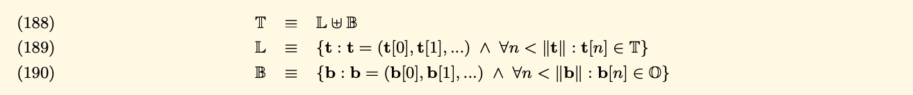
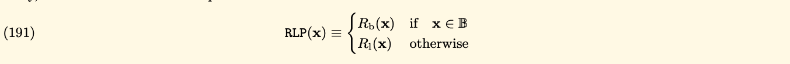
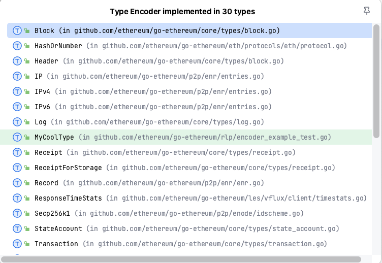

> The main purpose of this repository is understanding about how Ethereum
> serialize data(encoding/decoding).

#### Reference
- [Go-ethereum written by Go](https://github.com/ethereum/go-ethereum)
- [Go-ethereum analysis](https://github.com/agiletechvn/go-ethereum-code-analysis/blob/master/go-ethereum-code-analysis.md)
- [Yellow Paper](https://ethereum.github.io/yellowpaper/paper.pdf)
- [Documentation](https://ethereum.org/vi/developers/docs/data-structures-and-encoding/rlp)
- [Medium](https://medium.com/coinmonks/data-structure-in-ethereum-episode-1-recursive-length-prefix-rlp-encoding-decoding-d1016832f919)
- [Go-ethereum monorepo written by JS](https://github.com/ethereumjs/ethereumjs-monorepo)

> I will explain more detail with this package to help you and me understand clearly about
> source code.

#### Recursive Length Prefix
In short as RLP, RLP is the package Ethereum used to serialize all objects to the array of bytes.
It is described in Yellow Paper with many formulas, and very difficult to understand its.

Because Ethereum is a decentralized blockchain, that enables the execution of smart contracts and 
the storage of data on the blockchain, its need to be serialized or converted into a binary format,
stored in a minimal amount of space in the blockchain.

RLP is a prefix based encoding schema that encodes arbitrarily structured binary data(byte arrays) in a way that be easy to encode and decode its. 
RLP algorithm works by recursively encoding a list of items.

An item is defined as follows:
- A string(byte array)
- A list of "item" itself

For example:
- A string(byte array), includes an empty string
- A list containing any numbers of string
- A complex data structure like `["cat", ["dog", "mouse"], [], ["""]]`

#### Walk through into Yellow Paper(Appendix B)
We have three formulas that describes about **arbitrarily structured binary data(byte arrays)**:


- T: Arbitrarily structured binary data, is a set of byte arrays and structural sequences
- L: Set of all tree-like structures that are not a single leaf
- O: Set of 8-bit bytes
- B: Set of all sequences of bytes(bytes array or a leaf in tree)
- We use **disjoint union** to distinguish the empty byte array(in B) vs empty list(in L).

We define RLP function as RLP through two sub-functions:
- The first handling the byte arrays
- The second handle the sequences of further values


We will deep dive into the first function that handles the byte array, **RLP(B)**. If the value to be serialized is a 
byte array, the RLP(B) will take one of three forms:
- A single byte less than 128(decimal), the output is same the input
- If the array bytes contain fewer than 56 bytes, then the output is equal to the input prefixed by the byte
equal to the length of the array byte + 128
- Otherwise, the output is equal to the big endian representation of the input length in front of the input, and then preceded by (183 + the length of the big end of the input)
.png)


Second, we will see how the RLP(L) works. We use RLP(L) to encode each item, then concatenate the output.
- If the length is smaller than 56, the output is equal: 192 + length of item + item
- Otherwise, the output is equal: 247 + length of the big-endian of the length of item + the big-endian of the length of item + item
.png)

You can see **s(x)** is recursive of RLP with each item.

RLP algorithm as code like(example from ethereum.org):
```python
def rlp_encode(input):
    if isinstance(input,str):
        // 0x80 = 128(decimal)
        if len(input) == 1 and ord(input) < 0x80: return input
        else: return encode_length(len(input), 0x80) + input
    elif isinstance(input,list):
        output = ''
        for item in input: output += rlp_encode(item)
        return encode_length(len(output), 0xc0) + output

def encode_length(L,offset):
    if L < 56:
         return chr(L + offset)
    elif L < 256**8:
         BL = to_binary(L)
         return chr(len(BL) + offset + 55) + BL
    else:
         raise Exception("input too long")

def to_binary(x):
    if x == 0:
        return ''
    else:
        return to_binary(int(x / 256)) + chr(x % 256)
```

You can see the example in the Ethereum documentation with some inputs:
- A String "ethereum" => ["0x88", "e", "t", "h", "e", "r", "e", "u", "m"] => because the length of this 
string is 8 characters, is smaller than 56. So the output is encoded_length(8, 128) + input = **chr(136)** + "ethereum" = ["0x88", "e", "t", "h", "e", "r", "e", "u", "m"]
- A list ["ethereum", "foundation"]:
  - Same the example above, we got the output of `rlp_encode("ethereum") = ["0x88", "e", "t", "h", "e", "r", "e", "u", "m"]`
  - And `rlp_encode("foundation") = ["0x8A", "f", "o", "u", "n", "d", "a", "t", "i", "o", "n"]`
  - So, the output is `rlp_encode(["ethereum", "foundation"]) = encode_length(20, 192) + ["0x88", "e", "t", "h", "e", "r", "e", "u", "m", "0x8A", "f", "o", "u", "n", "d", "a", "t", "i", "o", "n"] = ["0xD4", "0x88", "e", "t", "h", "e", "r", "e", "u", "m", "0x8A", "f", "o", "u", "n", "d", "a", "t", "i", "o", "n"] `

### RLP decoding
Because of the rules of RLP encoding, so the input of RLP decoding is an array of binary data.
- Depend on the first byte in the input, we can determine the data type and the length of the data and offset.
- Depend on the data type and offset of data, decode the data correspondingly.
- Continue loop to decode the remain of input.

With the RLP formulas, we can determine to rules of decoding the data type and offset by the following:
- If the range of the first byte is from [0x00, 0x7f], and the length of the input is 1, so the data type is string and the data is the string itself.
- If the range of the first byte is from [0x80, 0xb7], the data type is string, and the length of the string is equal to the first byte minus 0x80
- If the range of the first byte is [0xb8, 0xbf], and the length of the string whose length in bytes is equal to the first byte minus 0xb7 follows the first byte, and the string follows the length of the string;
- If the range of the first byte is [0xc0, 0xf7], and the concatenation of the RLP encodings of all items of the list which the total payload is equal to the first byte minus 0xc0 follows the first byte; 
- If the range of the first byte is [0xf8, 0xff], and the total payload of the list whose length is equal to the first byte minus 0xf7 follows the first byte, and the concatenation of the RLP encodings of all items of the list follows the total payload of the list;
<br/>

**Source: Ethereum Docs**

**The pseudo code from Ethereum Docs:**
```python
def rlp_decode(input):
    if len(input) == 0:
        return
    output = ''
    (offset, dataLen, type) = decode_length(input)
    if type is str:
        output = instantiate_str(substr(input, offset, dataLen))
    elif type is list:
        output = instantiate_list(substr(input, offset, dataLen))
    output + rlp_decode(substr(input, offset + dataLen))
    return output

def decode_length(input):
    length = len(input)
    if length == 0:
        raise Exception("input is null")
    prefix = ord(input[0])
    if prefix <= 0x7f:
        return (0, 1, str)
    elif prefix <= 0xb7 and length > prefix - 0x80:
        strLen = prefix - 0x80
        return (1, strLen, str)
    elif prefix <= 0xbf and length > prefix - 0xb7 and length > prefix - 0xb7 + to_integer(substr(input, 1, prefix - 0xb7)):
        lenOfStrLen = prefix - 0xb7
        strLen = to_integer(substr(input, 1, lenOfStrLen))
        return (1 + lenOfStrLen, strLen, str)
    elif prefix <= 0xf7 and length > prefix - 0xc0:
        listLen = prefix - 0xc0;
        return (1, listLen, list)
    elif prefix <= 0xff and length > prefix - 0xf7 and length > prefix - 0xf7 + to_integer(substr(input, 1, prefix - 0xf7)):
        lenOfListLen = prefix - 0xf7
        listLen = to_integer(substr(input, 1, lenOfListLen))
        return (1 + lenOfListLen, listLen, list)
    else:
        raise Exception("input does not conform to RLP encoding form")

def to_integer(b):
    length = len(b)
    if length == 0:
        raise Exception("input is null")
    elif length == 1:
        return ord(b[0])
    else:
        return ord(substr(b, -1)) + to_integer(substr(b, 0, -1)) * 256
```


> Very difficult to fully understand with these formulas, so we need to debug to know what the output
> when we use RLP to encode/decode the arbitrarily structured binary data.


### Go-ethereum RLP
> If you don't similar with Golang, you can read other version written by [Typescript](https://github.dev/ethereumjs/ethereumjs-monorepo/tree/master/packages/rlp)
> With me, this version is easier to understand than the original version written by Golang :D

**RLP package structures:**
```tree
├── decode.go
├── decode_tail_test.go
├── decode_test.go
├── doc.go
├── encbuffer.go
├── encbuffer_example_test.go
├── encode.go
├── encode_test.go
├── encoder_example_test.go
├── internal
│   └── rlpstruct
│       └── rlpstruct.go
├── iterator.go
├── iterator_test.go
├── raw.go
├── raw_test.go
├── rlpgen
│   ├── gen.go
│   ├── gen_test.go
│   ├── main.go
│   ├── testdata
│   │   ├── bigint.in.txt
│   │   ├── bigint.out.txt
│   │   ├── nil.in.txt
│   │   ├── nil.out.txt
│   │   ├── optional.in.txt
│   │   ├── optional.out.txt
│   │   ├── rawvalue.in.txt
│   │   ├── rawvalue.out.txt
│   │   ├── uint256.in.txt
│   │   ├── uint256.out.txt
│   │   ├── uints.in.txt
│   │   └── uints.out.txt
│   └── types.go
├── safe.go
├── typecache.go
└── unsafe.go
```


**encode.go**

First, let's see the `Encode` interface
```go
type Encoder interface {
	EncodeRLP(io.Writer) error
}
```
This interface has only one function, that takes `io.Writer` as the input, and write the output to `io.Writer` directly.
Everything is stored on Ethereum blockchain so uses RLP to encode. There are so many implementations:



Next, we have a function called `func Encode(w io.Writer, val interface{}) error`, that will take the `w` and `v` to encode to binary data.
```go
func Encode(w io.Writer, val interface{}) error {
    // Optimization: reuse *encBuffer when called by EncodeRLP.
    if buf := encBufferFromWriter(w); buf != nil {
        return buf.encode(val)
    }

    buf := getEncBuffer()
    defer encBufferPool.Put(buf)
    if err := buf.encode(val); err != nil {
        return err
    }
    return buf.writeTo(w)
}
```
This is main function that is called by the implementations to encode the input. Go-ethereum use `encBufferFromWriter` to reduce the allocation, we will go into it.


```go
func encBufferFromWriter(w io.Writer) *encBuffer {
	switch w := w.(type) {
	case EncoderBuffer:
		return w.buf
	case *EncoderBuffer:
		return w.buf
	case *encBuffer:
		return w
	default:
		return nil
	}
}
```
The main reason because the authors are using `encBuffer` struct to encode the input data. So, if the `w` is `encBuffer` type, we reuse it to encode the input.


But I have a question, why they need to create a new struct `encBuffer` to encode? Let's see. In some previous of Go-ethereum, they don't use this struct.
The struct `encBuffer` is:
```go
// EncoderBuffer is a buffer for incremental encoding.
//
// The zero value is NOT ready for use. To get a usable buffer,
// create it using NewEncoderBuffer or call Reset.
type EncoderBuffer struct {
	buf *encBuffer
	dst io.Writer

	ownBuffer bool
}

type listhead struct {
    offset int // index of this header in string data
    size   int // total size of encoded data (including list headers)
}

type encBuffer struct {
    str     []byte     // string data, contains everything except list headers
    lheads  []listhead // all list headers
    lhsize  int        // sum of sizes of all encoded list headers
    sizebuf [9]byte    // auxiliary buffer for uint encoding
}
```

and in `encbuffer.go`, we have a sync pool that stores `encBuffer`
```go
// The global encBuffer pool.
var encBufferPool = sync.Pool{
	New: func() interface{} { return new(encBuffer) },
}

```
In the conclusion, we have some points:
- `go-ethereum` use `encBuffer` to store the binary output that are encoded
- They use `a pool` to store `encBuffer` to reuse in the next step

Next step, we have a function `buf.encode(val)` to encode `val` based on what's type of `val`
```go
func (buf *encBuffer) encode(val interface{}) error {
	rval := reflect.ValueOf(val)
	writer, err := cachedWriter(rval.Type())
	if err != nil {
		return err
	}
	return writer(rval, buf)
}
```
You can see, `go-ethereum` uses reflection and encodes RLP based on the Go type of the value. The `writer` is a function that 
will encode based on the type and write to `encBuffer`

We have other function `cachedWriter` that will return the `writer` function with the Go type.

```go
func cachedWriter(typ reflect.Type) (writer, error) {
	info := theTC.info(typ)
	return info.writer, info.writerErr
}
```
They use `typeCache` struct to cache the writer of the Go type. More detail, you can go into `typecache.go` to see. 
```go
type typeCache struct {
	cur atomic.Value

	// This lock synchronizes writers.
	mu   sync.Mutex
	next map[typekey]*typeinfo
}
```
We have:
- `cur`: to store the map writer. The value of `cur` is `map[typekey]*typeinfo`
- `mu`: use `sync.Mutex` to lock the synchronizes writer
- `next`: the map stores the next map

`go-ethereum` use map to store the writer function based on the Go type. This map will store in-mem when the `geth` is running.

Walk through more functions inside `theTC.info(typ)`, we will see the main function that determine what's the writer function
based on the `typ`
```go
// encode.go
func makeWriter(typ reflect.Type, ts rlpstruct.Tags) (writer, error) {
	kind := typ.Kind()
	switch {
	case typ == rawValueType:
		return writeRawValue, nil
	case typ.AssignableTo(reflect.PtrTo(bigInt)):
		return writeBigIntPtr, nil
	case typ.AssignableTo(bigInt):
		return writeBigIntNoPtr, nil
	case typ == reflect.PtrTo(u256Int):
		return writeU256IntPtr, nil
	case typ == u256Int:
		return writeU256IntNoPtr, nil
	case kind == reflect.Ptr:
		return makePtrWriter(typ, ts)
	case reflect.PtrTo(typ).Implements(encoderInterface):
		return makeEncoderWriter(typ), nil
	case isUint(kind):
		return writeUint, nil
	case kind == reflect.Bool:
		return writeBool, nil
	case kind == reflect.String:
		return writeString, nil
	case kind == reflect.Slice && isByte(typ.Elem()):
		return writeBytes, nil
	case kind == reflect.Array && isByte(typ.Elem()):
		return makeByteArrayWriter(typ), nil
	case kind == reflect.Slice || kind == reflect.Array:
		return makeSliceWriter(typ, ts)
	case kind == reflect.Struct:
		return makeStructWriter(typ)
	case kind == reflect.Interface:
		return writeInterface, nil
	default:
		return nil, fmt.Errorf("rlp: type %v is not RLP-serializable", typ)
	}
}
```

In the conclusion, we have some points:
- `go-ethereum` use the in-mem map to cache the writer encode function based on the Go type
- `go-etherem` use `encBuffer` struct to store the binary data that are encoded by `writer`
- After we encoded the input, they will write the output back into `w`
```go
// writeTo writes the encoder output to w.
func (buf *encBuffer) writeTo(w io.Writer) (err error) {
	strpos := 0
	for _, head := range buf.lheads {
		// write string data before header
		if head.offset-strpos > 0 {
			n, err := w.Write(buf.str[strpos:head.offset])
			strpos += n
			if err != nil {
				return err
			}
		}
		// write the header
		enc := head.encode(buf.sizebuf[:])
		if _, err = w.Write(enc); err != nil {
			return err
		}
	}
	if strpos < len(buf.str) {
		// write string data after the last list header
		_, err = w.Write(buf.str[strpos:])
	}
	return err
}
```
> RLP package written by Go is very difficult to understand than `Typescript` version :D. 
> But they add more technical in there to reduce the allocation, reduce the time of encoding by using the in-mem map to store
> the `writer` encode function based on the Go type.


**decode.go**

We have the same approach as `encode` with Decode interface, but now, the input of decoding is `Stream`, not `io.Writer` like encoding.
```go
// ByteReader must be implemented by any input reader for a Stream. It
// is implemented by e.g. bufio.Reader and bytes.Reader.
type ByteReader interface {
    io.Reader
    io.ByteReader
}

// Stream can be used for piecemeal decoding of an input stream. This
// is useful if the input is very large or if the decoding rules for a
// type depend on the input structure. Stream does not keep an
// internal buffer. After decoding a value, the input reader will be
// positioned just before the type information for the next value.
//
// When decoding a list and the input position reaches the declared
// length of the list, all operations will return error EOL.
// The end of the list must be acknowledged using ListEnd to continue
// reading the enclosing list.
//
// Stream is not safe for concurrent use.
type Stream struct {
    r ByteReader

    remaining uint64   // number of bytes remaining to be read from r
    size      uint64   // size of value ahead
    kinderr   error    // error from last readKind
    stack     []uint64 // list sizes
    uintbuf   [32]byte // auxiliary buffer for integer decoding
    kind      Kind     // kind of value ahead
    byteval   byte     // value of single byte in type tag
    limited   bool     // true if input limit is in effect
}
```

Because the `decode` works the same approach with `encode`. I don't go to the deep right now. :D. But I have some points:
- `decode` use map that is cached in-mem 
- We have `decoder` function based on the length and the first element of the input

```go
func makeDecoder(typ reflect.Type, tags rlpstruct.Tags) (dec decoder, err error) {
	kind := typ.Kind()
	switch {
	case typ == rawValueType:
		return decodeRawValue, nil
	case typ.AssignableTo(reflect.PtrTo(bigInt)):
		return decodeBigInt, nil
	case typ.AssignableTo(bigInt):
		return decodeBigIntNoPtr, nil
	case typ == reflect.PtrTo(u256Int):
		return decodeU256, nil
	case typ == u256Int:
		return decodeU256NoPtr, nil
	case kind == reflect.Ptr:
		return makePtrDecoder(typ, tags)
	case reflect.PtrTo(typ).Implements(decoderInterface):
		return decodeDecoder, nil
	case isUint(kind):
		return decodeUint, nil
	case kind == reflect.Bool:
		return decodeBool, nil
	case kind == reflect.String:
		return decodeString, nil
	case kind == reflect.Slice || kind == reflect.Array:
		return makeListDecoder(typ, tags)
	case kind == reflect.Struct:
		return makeStructDecoder(typ)
	case kind == reflect.Interface:
		return decodeInterface, nil
	default:
		return nil, fmt.Errorf("rlp: type %v is not RLP-serializable", typ)
	}
}
```


### Summary 
RLP is an algorithm that is used in Ethereum to encode/decode the arbitrary structured binary data. RLP is mentioned
on the `Yellow Paper` but very difficult to understand fully in the first time.

