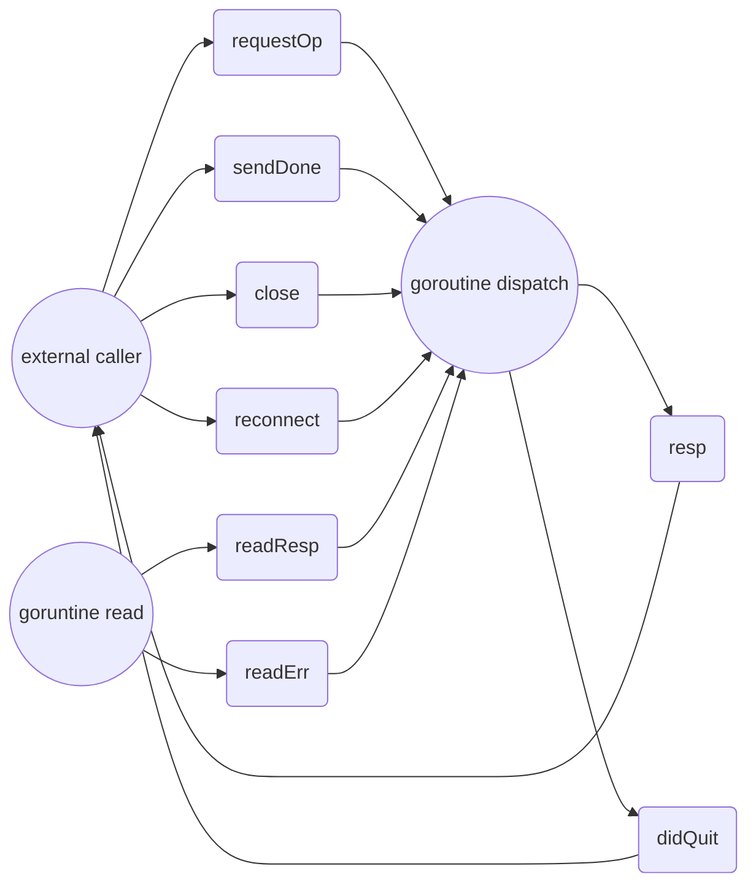

## RPC package documentation

Package rpc provides access to the exported methods of an object across a network
or other I/O connection. After creating a server instance objects can be registered,
making it visible from the outside. Exported methods that follow specific
conventions can be called remotely. It also has support for the publish/subscribe
pattern.

Methods that satisfy the following criteria are made available for remote access:

- object must be exported
- method must be exported
- method returns 0, 1 (response or error) or 2 (response and error) values
- method argument(s) must be exported or builtin types
- method returned value(s) must be exported or builtin types

An example method:

    func (s *CalcService) Add(a, b int) (int, error)

When the returned error isn't nil the returned integer is ignored and the error is
send back to the client. Otherwise the returned integer is send back to the client.

Optional arguments are supported by accepting pointer values as arguments. E.g.
if we want to do the addition in an optional finite field we can accept a mod
argument as pointer value.

     func (s *CalService) Add(a, b int, mod *int) (int, error)

This RPC method can be called with 2 integers and a null value as third argument.
In that case the mod argument will be nil. Or it can be called with 3 integers,
in that case mod will be pointing to the given third argument. Since the optional
argument is the last argument the RPC package will also accept 2 integers as
arguments. It will pass the mod argument as nil to the RPC method.

The server offers the ServeCodec method which accepts a ServerCodec instance. It will
read requests from the codec, process the request and sends the response back to the
client using the codec. The server can execute requests concurrently. Responses
can be sent back to the client out of order.

```go
//An example server which uses the JSON codec:
type CalculatorService struct {}

func (s *CalculatorService) Add(a, b int) int {
	return a + b
}

func (s *CalculatorService Div(a, b int) (int, error) {
	if b == 0 {
		return 0, errors.New("divide by zero")
	}
	return a/b, nil
}

calculator := new(CalculatorService)
server := NewServer()
server.RegisterName("calculator", calculator)

l, _ := net.ListenUnix("unix", &net.UnixAddr{Net: "unix", Name: "/tmp/calculator.sock"})
for {
	c, _ := l.AcceptUnix()
	codec := v2.NewJSONCodec(c)
	go server.ServeCodec(codec)
}
```

The package also supports the publish subscribe pattern through the use of subscriptions.
A method that is considered eligible for notifications must satisfy the following criteria:

- object must be exported
- method must be exported
- first method argument type must be context.Context
- method argument(s) must be exported or builtin types
- method must return the tuple Subscription, error

An example method:

     func (s *BlockChainService) NewBlocks(ctx context.Context) (Subscription, error) {
     	...
     }

Subscriptions are deleted when:

- the user sends an unsubscribe request
- the connection which was used to create the subscription is closed. This can be initiated
  by the client and server. The server will close the connection on an write error or when
  the queue of buffered notifications gets too big.

## RPC structure

The encoding and decoding of requests and responses for network protocol channels and Json formats are classes that deal with both the server and the client. Network protocol channels mainly provide connectivity and data transfer capabilities. The encoding and decoding of the json format mainly provides serialization and deserialization of requests and responses (objects of Json -> Go).

- Interfaces - types.go - utils.go

- Network protocols
  - http.go
  - websocket.go
  - ipc.go
- Logic

  - client.go
  - server.go
  - subscription.go

- Format
  - json.go

## Source code analysis

### server.go

Server.go mainly implements the core logic of the RPC server. Includes logic for registering RPC methods, reading requests, processing requests, and sending responses. The core data structure of the server is the Server structure. The services field is a map that records all registered methods and classes. The run parameter is used to control the running and stopping of the server. Codecs is a set. Used to store all codecs, in fact, all connections. codecsMu is a lock used to protect multithreaded access to codecs.

The value type of the services field is the service type. Service represents an instance registered to Server and is a combination of objects and methods. The name of the service field represents the namespace of the service, the type of the typ instance, callbacks is the callback method of the instance, and subscriptions is the subscription method of the instance.

```go
type serviceRegistry map[string]*service // collection of services
type callbacks map[string]*callback      // collection of RPC callbacks
type subscriptions map[string]*callback
type Server struct {
	services serviceRegistry

	run      int32
	codecsMu sync.Mutex
	codecs   *set.Set
}

// callback is a method callback which was registered in the server
type callback struct {
	rcvr        reflect.Value  // receiver of method
	method      reflect.Method // callback
	argTypes    []reflect.Type // input argument types
	hasCtx      bool           // method's first argument is a context (not included in argTypes)
	errPos      int            // err return idx, of -1 when method cannot return error
	isSubscribe bool           // indication if the callback is a subscription
}

// service represents a registered object
type service struct {
	name          string        // name for service
	typ           reflect.Type  // receiver type
	callbacks     callbacks     // registered handlers
	subscriptions subscriptions // available subscriptions/notifications
}
```

Server creation, when the server is created, register its own instance by calling server.RegisterName, and provide some meta information of the RPC service.

```go
const MetadataApi = "rpc"
// NewServer will create a new server instance with no registered handlers.
func NewServer() *Server {
	server := &Server{
		services: make(serviceRegistry),
		codecs:   set.New(),
		run:      1,
	}

	// register a default service which will provide meta information about the RPC service such as the services and
	// methods it offers.
	rpcService := &RPCService{server}
	server.RegisterName(MetadataApi, rpcService)

	return server
}
```

The service registers server.RegisterName, and the RegisterName method creates a service object with the passed parameters. If the passed rcvr instance does not find any suitable methods, an error is returned. If there are no errors, add the created service instance to the serviceRegistry.

```go
// RegisterName will create a service for the given rcvr type under the given name. When no methods on the given rcvr
// match the criteria to be either a RPC method or a subscription an error is returned. Otherwise a new service is
// created and added to the service collection this server instance serves.
func (s *Server) RegisterName(name string, rcvr interface{}) error {
	if s.services == nil {
		s.services = make(serviceRegistry)
	}

	svc := new(service)
	svc.typ = reflect.TypeOf(rcvr)
	rcvrVal := reflect.ValueOf(rcvr)

	if name == "" {
		return fmt.Errorf("no service name for type %s", svc.typ.String())
	}
	// If the instance's class name is not exported (the first letter of the class name is capitalized), an error is returned.
	if !isExported(reflect.Indirect(rcvrVal).Type().Name()) {
		return fmt.Errorf("%s is not exported", reflect.Indirect(rcvrVal).Type().Name())
	}
	// Find the appropriate callbacks and subscriptions methods by reflecting the information
	methods, subscriptions := suitableCallbacks(rcvrVal, svc.typ)
	// If the name is currently registered, then if there is a method with the same name, use the new one, or insert it directly.
	// already a previous service register under given sname, merge methods/subscriptions
	if regsvc, present := s.services[name]; present {
		if len(methods) == 0 && len(subscriptions) == 0 {
			return fmt.Errorf("Service %T doesn't have any suitable methods/subscriptions to expose", rcvr)
		}
		for _, m := range methods {
			regsvc.callbacks[formatName(m.method.Name)] = m
		}
		for _, s := range subscriptions {
			regsvc.subscriptions[formatName(s.method.Name)] = s
		}
		return nil
	}

	svc.name = name
	svc.callbacks, svc.subscriptions = methods, subscriptions

	if len(svc.callbacks) == 0 && len(svc.subscriptions) == 0 {
		return fmt.Errorf("Service %T doesn't have any suitable methods/subscriptions to expose", rcvr)
	}

	s.services[svc.name] = svc
	return nil
}
```

Find the appropriate method by reflecting the information, suitableCallbacks, which is in utils.go. This method traverses all methods of this type, finds methods that match the RPC callback or subscription callback type criteria and returns. For the standard of RPC, please refer to the RPC standard at the beginning of the document.

```go
// suitableCallbacks iterates over the methods of the given type. It will determine if a method satisfies the criteria
// for a RPC callback or a subscription callback and adds it to the collection of callbacks or subscriptions. See server
// documentation for a summary of these criteria.
func suitableCallbacks(rcvr reflect.Value, typ reflect.Type) (callbacks, subscriptions) {
	callbacks := make(callbacks)
	subscriptions := make(subscriptions)

METHODS:
	for m := 0; m < typ.NumMethod(); m++ {
		method := typ.Method(m)
		mtype := method.Type
		mname := formatName(method.Name)
		if method.PkgPath != "" { // method must be exported
			continue
		}

		var h callback
		h.isSubscribe = isPubSub(mtype)
		h.rcvr = rcvr
		h.method = method
		h.errPos = -1

		firstArg := 1
		numIn := mtype.NumIn()
		if numIn >= 2 && mtype.In(1) == contextType {
			h.hasCtx = true
			firstArg = 2
		}

		if h.isSubscribe {
			h.argTypes = make([]reflect.Type, numIn-firstArg) // skip rcvr type
			for i := firstArg; i < numIn; i++ {
				argType := mtype.In(i)
				if isExportedOrBuiltinType(argType) {
					h.argTypes[i-firstArg] = argType
				} else {
					continue METHODS
				}
			}

			subscriptions[mname] = &h
			continue METHODS
		}

		// determine method arguments, ignore first arg since it's the receiver type
		// Arguments must be exported or builtin types
		h.argTypes = make([]reflect.Type, numIn-firstArg)
		for i := firstArg; i < numIn; i++ {
			argType := mtype.In(i)
			if !isExportedOrBuiltinType(argType) {
				continue METHODS
			}
			h.argTypes[i-firstArg] = argType
		}

		// check that all returned values are exported or builtin types
		for i := 0; i < mtype.NumOut(); i++ {
			if !isExportedOrBuiltinType(mtype.Out(i)) {
				continue METHODS
			}
		}

		// when a method returns an error it must be the last returned value
		h.errPos = -1
		for i := 0; i < mtype.NumOut(); i++ {
			if isErrorType(mtype.Out(i)) {
				h.errPos = i
				break
			}
		}

		if h.errPos >= 0 && h.errPos != mtype.NumOut()-1 {
			continue METHODS
		}

		switch mtype.NumOut() {
		case 0, 1, 2:
			if mtype.NumOut() == 2 && h.errPos == -1 { // method must one return value and 1 error
				continue METHODS
			}
			callbacks[mname] = &h
		}
	}

	return callbacks, subscriptions
}
```

Server startup and services, server startup and services here refer to some of the code in ipc.go. You can see a link for each Accept(), and start a goroutine call srv.ServeCodec for service. Here you can also see the function of JsonCodec. Codec is similar to the decorator mode, and it has a layer of bread on the connection. Codec will be introduced later, here is a brief look.

```go
func (srv *Server) ServeListener(l net.Listener) error {
	for {
		conn, err := l.Accept()
		if err != nil {
			return err
		}
		log.Trace(fmt.Sprint("accepted conn", conn.RemoteAddr()))
		go srv.ServeCodec(NewJSONCodec(conn), OptionMethodInvocation|OptionSubscriptions)
	}
}
```

ServeCodec, this method is very simple, provides the shutdown function of codec.Close. The second parameter of serveRequest, singleShot, is a parameter that controls long or short connections. If singleShot is true, it will exit after processing a request. However, our serveRequest method is an infinite loop, no exception is encountered, or the client is actively closed, the server will not close. So rpc provides the function of long connections.

```go
// ServeCodec reads incoming requests from codec, calls the appropriate callback and writes the
// response back using the given codec. It will block until the codec is closed or the server is
// stopped. In either case the codec is closed.
func (s *Server) ServeCodec(codec ServerCodec, options CodecOption) {
	defer codec.Close()
	s.serveRequest(codec, false, options)
}
```

Our heavy method finally came out, and the serveRequest method is the main processing flow of the server. Read the request from codec, find the corresponding method and call it, then write the response to codec.

Some standard library code can refer to the online tutorial, sync.WaitGroup implements a semaphore function. Context implements context management.

```go
// serveRequest will reads requests from the codec, calls the RPC callback and
// writes the response to the given codec.
//
// If singleShot is true it will process a single request, otherwise it will handle
// requests until the codec returns an error when reading a request (in most cases
// an EOF). It executes requests in parallel when singleShot is false.
func (s *Server) serveRequest(codec ServerCodec, singleShot bool, options CodecOption) error {
	var pend sync.WaitGroup
	defer func() {
		if err := recover(); err != nil {
			const size = 64 << 10
			buf := make([]byte, size)
			buf = buf[:runtime.Stack(buf, false)]
			log.Error(string(buf))
		}
		s.codecsMu.Lock()
		s.codecs.Remove(codec)
		s.codecsMu.Unlock()
	}()

	ctx, cancel := context.WithCancel(context.Background())
	defer cancel()

	// if the codec supports notification include a notifier that callbacks can use
	// to send notification to clients. It is thight to the codec/connection. If the
	// connection is closed the notifier will stop and cancels all active subscriptions.
	if options&OptionSubscriptions == OptionSubscriptions {
		ctx = context.WithValue(ctx, notifierKey{}, newNotifier(codec))
	}
	s.codecsMu.Lock()
	if atomic.LoadInt32(&s.run) != 1 { // server stopped
		s.codecsMu.Unlock()
		return &shutdownError{}
	}
	s.codecs.Add(codec)
	s.codecsMu.Unlock()

	// test if the server is ordered to stop
	for atomic.LoadInt32(&s.run) == 1 {
		reqs, batch, err := s.readRequest(codec)
		if err != nil {
			// If a parsing error occurred, send an error
			if err.Error() != "EOF" {
				log.Debug(fmt.Sprintf("read error %v\n", err))
				codec.Write(codec.CreateErrorResponse(nil, err))
			}
			// Error or end of stream, wait for requests and tear down
			// Here is mainly to consider the multi-thread processing when waiting for all the request processing is completed,
			//everever a go thread is started will call pend.Add(1).
			// Calling pend.Done() after processing is complete will subtract 1. When it is 0, the Wait() method will return.
			pend.Wait()
			return nil
		}

		// check if server is ordered to shutdown and return an error
		// telling the client that his request failed.
		if atomic.LoadInt32(&s.run) != 1 {
			err = &shutdownError{}
			if batch {
				resps := make([]interface{}, len(reqs))
				for i, r := range reqs {
					resps[i] = codec.CreateErrorResponse(&r.id, err)
				}
				codec.Write(resps)
			} else {
				codec.Write(codec.CreateErrorResponse(&reqs[0].id, err))
			}
			return nil
		}
		// If a single shot request is executing, run and return immediately
		if singleShot {
			if batch {
				s.execBatch(ctx, codec, reqs)
			} else {
				s.exec(ctx, codec, reqs[0])
			}
			return nil
		}
		// For multi-shot connections, start a goroutine to serve and loop back
		pend.Add(1)
		go func(reqs []*serverRequest, batch bool) {
			defer pend.Done()
			if batch {
				s.execBatch(ctx, codec, reqs)
			} else {
				s.exec(ctx, codec, reqs[0])
			}
		}(reqs, batch)
	}
	return nil
}
```

The readRequest method reads the request from codec and then assembles the corresponding method into the requests object based on the request. rpcRequest is the type of request returned by codec. j

```go
type rpcRequest struct {
	service  string
	method   string
	id       interface{}
	isPubSub bool
	params   interface{}
	err      Error // invalid batch element
}
```

Request returned after serverRequest is processed

```go
// serverRequest is an incoming request
type serverRequest struct {
	id            interface{}
	svcname       string
	callb         *callback
	args          []reflect.Value
	isUnsubscribe bool
	err           Error
}
```

The readRequest method reads the request from codec and processes the request to generate a serverRequest object.

```go
// readRequest requests the next (batch) request from the codec. It will return the collection
// of requests, an indication if the request was a batch, the invalid request identifier and an
// error when the request could not be read/parsed.
func (s *Server) readRequest(codec ServerCodec) ([]*serverRequest, bool, Error) {
	reqs, batch, err := codec.ReadRequestHeaders()
	if err != nil {
		return nil, batch, err
	}
	requests := make([]*serverRequest, len(reqs))
	// Build requests based on reqs
	// verify requests
	for i, r := range reqs {
		var ok bool
		var svc *service

		if r.err != nil {
			requests[i] = &serverRequest{id: r.id, err: r.err}
			continue
		}
		// If the request is a send/subscribe request, and the method name has the _unsubscribe suffix.
		if r.isPubSub && strings.HasSuffix(r.method, unsubscribeMethodSuffix) {
			requests[i] = &serverRequest{id: r.id, isUnsubscribe: true}
			argTypes := []reflect.Type{reflect.TypeOf("")} // expect subscription id as first arg
			if args, err := codec.ParseRequestArguments(argTypes, r.params); err == nil {
				requests[i].args = args
			} else {
				requests[i].err = &invalidParamsError{err.Error()}
			}
			continue
		}
		// If you have not registered this service.
		if svc, ok = s.services[r.service]; !ok { // rpc method isn't available
			requests[i] = &serverRequest{id: r.id, err: &methodNotFoundError{r.service, r.method}}
			continue
		}
		// If it is a publish and subscribe mode. Call the subscription method.
		if r.isPubSub { // eth_subscribe, r.method contains the subscription method name
			if callb, ok := svc.subscriptions[r.method]; ok {
				requests[i] = &serverRequest{id: r.id, svcname: svc.name, callb: callb}
				if r.params != nil && len(callb.argTypes) > 0 {
					argTypes := []reflect.Type{reflect.TypeOf("")}
					argTypes = append(argTypes, callb.argTypes...)
					if args, err := codec.ParseRequestArguments(argTypes, r.params); err == nil {
						requests[i].args = args[1:] // first one is service.method name which isn't an actual argument
					} else {
						requests[i].err = &invalidParamsError{err.Error()}
					}
				}
			} else {
				requests[i] = &serverRequest{id: r.id, err: &methodNotFoundError{r.method, r.method}}
			}
			continue
		}

		if callb, ok := svc.callbacks[r.method]; ok { // lookup RPC method
			requests[i] = &serverRequest{id: r.id, svcname: svc.name, callb: callb}
			if r.params != nil && len(callb.argTypes) > 0 {
				if args, err := codec.ParseRequestArguments(callb.argTypes, r.params); err == nil {
					requests[i].args = args
				} else {
					requests[i].err = &invalidParamsError{err.Error()}
				}
			}
			continue
		}

		requests[i] = &serverRequest{id: r.id, err: &methodNotFoundError{r.service, r.method}}
	}

	return requests, batch, nil
}
```

exec and execBatch method, call s.handle method of request processing.

```go
// exec executes the given request and writes the result back using the codec.
func (s *Server) exec(ctx context.Context, codec ServerCodec, req *serverRequest) {
	var response interface{}
	var callback func()
	if req.err != nil {
		response = codec.CreateErrorResponse(&req.id, req.err)
	} else {
		response, callback = s.handle(ctx, codec, req)
	}

	if err := codec.Write(response); err != nil {
		log.Error(fmt.Sprintf("%v\n", err))
		codec.Close()
	}

	// when request was a subscribe request this allows these subscriptions to be actived
	if callback != nil {
		callback()
	}
}

// execBatch executes the given requests and writes the result back using the codec.
// It will only write the response back when the last request is processed.
func (s *Server) execBatch(ctx context.Context, codec ServerCodec, requests []*serverRequest) {
	responses := make([]interface{}, len(requests))
	var callbacks []func()
	for i, req := range requests {
		if req.err != nil {
			responses[i] = codec.CreateErrorResponse(&req.id, req.err)
		} else {
			var callback func()
			if responses[i], callback = s.handle(ctx, codec, req); callback != nil {
				callbacks = append(callbacks, callback)
			}
		}
	}

	if err := codec.Write(responses); err != nil {
		log.Error(fmt.Sprintf("%v\n", err))
		codec.Close()
	}

	// when request holds one of more subscribe requests this allows these subscriptions to be activated
	for _, c := range callbacks {
		c()
	}
}
```

Handle method, execute a request, then return response

```go
// handle executes a request and returns the response from the callback.
func (s *Server) handle(ctx context.Context, codec ServerCodec, req *serverRequest) (interface{}, func()) {
	if req.err != nil {
		return codec.CreateErrorResponse(&req.id, req.err), nil
	}
	// If it is a publish and subscribe mode. Call the subscription method....
	if req.isUnsubscribe { // cancel subscription, first param must be the subscription id
		if len(req.args) >= 1 && req.args[0].Kind() == reflect.String {
			notifier, supported := NotifierFromContext(ctx)
			if !supported { // interface doesn't support subscriptions (e.g. http)
				return codec.CreateErrorResponse(&req.id, &callbackError{ErrNotificationsUnsupported.Error()}), nil
			}

			subid := ID(req.args[0].String())
			if err := notifier.unsubscribe(subid); err != nil {
				return codec.CreateErrorResponse(&req.id, &callbackError{err.Error()}), nil
			}

			return codec.CreateResponse(req.id, true), nil
		}
		return codec.CreateErrorResponse(&req.id, &invalidParamsError{"Expected subscription id as first argument"}), nil
	}
	// If it is a subscription message. Then create a subscription. And activate the subscription.
	if req.callb.isSubscribe {
		subid, err := s.createSubscription(ctx, codec, req)
		if err != nil {
			return codec.CreateErrorResponse(&req.id, &callbackError{err.Error()}), nil
		}

		// active the subscription after the sub id was successfully sent to the client
		activateSub := func() {
			notifier, _ := NotifierFromContext(ctx)
			notifier.activate(subid, req.svcname)
		}

		return codec.CreateResponse(req.id, subid), activateSub
	}

	// regular RPC call, prepare arguments
	if len(req.args) != len(req.callb.argTypes) {
		rpcErr := &invalidParamsError{fmt.Sprintf("%s%s%s expects %d parameters, got %d",
			req.svcname, serviceMethodSeparator, req.callb.method.Name,
			len(req.callb.argTypes), len(req.args))}
		return codec.CreateErrorResponse(&req.id, rpcErr), nil
	}

	arguments := []reflect.Value{req.callb.rcvr}
	if req.callb.hasCtx {
		arguments = append(arguments, reflect.ValueOf(ctx))
	}
	if len(req.args) > 0 {
		arguments = append(arguments, req.args...)
	}
	// Call the provided rpc method and get reply
	// execute RPC method and return result
	reply := req.callb.method.Func.Call(arguments)
	if len(reply) == 0 {
		return codec.CreateResponse(req.id, nil), nil
	}

	if req.callb.errPos >= 0 { // test if method returned an error
		if !reply[req.callb.errPos].IsNil() {
			e := reply[req.callb.errPos].Interface().(error)
			res := codec.CreateErrorResponse(&req.id, &callbackError{e.Error()})
			return res, nil
		}
	}
	return codec.CreateResponse(req.id, reply[0].Interface()), nil
}
```

### subscription.go publish subscription mode.

In the previous server.go, there were some code for publishing the subscription mode, which is elaborated here.

We have this code in the code of serveRequest.

    If codec supports it, you can send a message to the client via a callback function called notifier.

He has a close relationship with codec/connection. If the connection is closed, the notifier will close and all active subscriptions will be revoked.

```go
// if the codec supports notification include a notifier that callbacks can use
// to send notification to clients. It is thight to the codec/connection. If the
// connection is closed the notifier will stop and cancels all active subscriptions.
if options&OptionSubscriptions == OptionSubscriptions {
	ctx = context.WithValue(ctx, notifierKey{}, newNotifier(codec))
}
```

When serving a client connection, the newNotifier method is called to create a notifier object stored in ctx. You can observe that the Notifier object holds an instance of codec, which means that the Notifier object holds a network connection and is used to send data when needed.

```go
// newNotifier creates a new notifier that can be used to send subscription
// notifications to the client.
func newNotifier(codec ServerCodec) *Notifier {
	return &Notifier{
		codec:    codec,
		active:   make(map[ID]*Subscription),
		inactive: make(map[ID]*Subscription),
	}
}
```

Then handle approach, we are dealing with a special kind of method, which is identified as isSubscribe. CreateSubscription call method creates a Subscription and call notifier.activate way to store the notifier activation queue inside. There is a trick in the code. After the method call is completed, the subscription is not directly activated, but the code of the active part is returned as a function. Then wait for the code inside exec or execBatch codec.CreateResponse (req.id, subid) This response is sent to the client after being called. Prevent the client from receiving the subscription information when it has not received the subscription ID.

```go
if req.callb.isSubscribe {
	subid, err := s.createSubscription(ctx, codec, req)
	if err != nil {
		return codec.CreateErrorResponse(&req.id, &callbackError{err.Error()}), nil
	}

	// active the subscription after the sub id was successfully sent to the client
	activateSub := func() {
		notifier, _ := NotifierFromContext(ctx)
		notifier.activate(subid, req.svcname)
	}

	return codec.CreateResponse(req.id, subid), activateSub
}
```

The createSubscription method will call the specified registered method and get a response.

```go
// createSubscription will call the subscription callback and returns the subscription id or error.
func (s *Server) createSubscription(ctx context.Context, c ServerCodec, req *serverRequest) (ID, error) {
	// subscription have as first argument the context following optional arguments
	args := []reflect.Value{req.callb.rcvr, reflect.ValueOf(ctx)}
	args = append(args, req.args...)
	reply := req.callb.method.Func.Call(args)

	if !reply[1].IsNil() { // subscription creation failed
		return "", reply[1].Interface().(error)
	}

	return reply[0].Interface().(*Subscription).ID, nil
}
```

Take a look at our activate method, which activates the subscription. The subscription is activated after the subscription ID is sent to the client, preventing the client from receiving the subscription information when it has not received the subscription ID.

```go
// activate enables a subscription. Until a subscription is enabled all
// notifications are dropped. This method is called by the RPC server after
// the subscription ID was sent to client. This prevents notifications being
// send to the client before the subscription ID is send to the client.
func (n *Notifier) activate(id ID, namespace string) {
	n.subMu.Lock()
	defer n.subMu.Unlock()
	if sub, found := n.inactive[id]; found {
		sub.namespace = namespace
		n.active[id] = sub
		delete(n.inactive, id)
	}
}
```

Let's look at a function to unsubscribe.

```go
// unsubscribe a subscription.
// If the subscription could not be found ErrSubscriptionNotFound is returned.
func (n *Notifier) unsubscribe(id ID) error {
	n.subMu.Lock()
	defer n.subMu.Unlock()
	if s, found := n.active[id]; found {
		close(s.err)
		delete(n.active, id)
		return nil
	}
	return ErrSubscriptionNotFound
}
```

Finally, a function that sends a subscription, calling this function to send data to the client, is also relatively simple.

```go
// Notify sends a notification to the client with the given data as payload.
// If an error occurs the RPC connection is closed and the error is returned.
func (n *Notifier) Notify(id ID, data interface{}) error {
	n.subMu.RLock()
	defer n.subMu.RUnlock()

	sub, active := n.active[id]
	if active {
		notification := n.codec.CreateNotification(string(id), sub.namespace, data)
		if err := n.codec.Write(notification); err != nil {
			n.codec.Close()
			return err
		}
	}
	return nil
}
```

How to use the suggestions to see the complete process through TestNotifications of subscription_test.go.

### client.go RPC analysis

The main function of the client is to send the request to the server, then receive the response, and then pass the response to the caller.

Client data structure

```go
// Client represents a connection to an RPC server.
type Client struct {
	idCounter   uint32
	// The function that generates the connection, the client will call this function to generate a network connection object.
	connectFunc func(ctx context.Context) (net.Conn, error)
	// The HTTP protocol and the non-HTTP protocol have different processing procedures. The HTTP protocol does not support long connections. It only supports one mode for requesting one response, and does not support the publish/subscribe mode.
	isHTTP      bool

	// writeConn is only safe to access outside dispatch, with the
	// write lock held. The write lock is taken by sending on
	// requestOp and released by sending on sendDone.
	writeConn net.Conn

	// for dispatch
	// There are a lot of channels below. The channel is generally the channel used for communication between goroutines. The code will introduce how the channel is used.
	close       chan struct{}
	didQuit     chan struct{}                  // closed when client quits
	reconnected chan net.Conn                  // where write/reconnect sends the new connection
	readErr     chan error                     // errors from read
	readResp    chan []*jsonrpcMessage         // valid messages from read
	requestOp   chan *requestOp                // for registering response IDs
	sendDone    chan error                     // signals write completion, releases write lock
	respWait    map[string]*requestOp          // active requests
	subs        map[string]*ClientSubscription // active subscriptions
}
```

newClient, create a new client. Get a network connection by calling the connectFunc method, if the network connection is an httpConn object, then isHTTP is set to true. Then the initialization of the object, if it is an HTTP connection, return directly, otherwise start a goroutine call dispatch method. The dispatch method is the command center of the entire client. It communicates with other gorouts through the above mentioned channels to obtain information and make various decisions based on the information. The follow-up will detail the dispatch. Because the way HTTP is called is very simple, here is a brief explanation of the way HTTP is used.

```go
func newClient(initctx context.Context, connectFunc func(context.Context) (net.Conn, error)) (*Client, error) {
	conn, err := connectFunc(initctx)
	if err != nil {
		return nil, err
	}
	_, isHTTP := conn.(*httpConn)

	c := &Client{
		writeConn:   conn,
		isHTTP:      isHTTP,
		connectFunc: connectFunc,
		close:       make(chan struct{}),
		didQuit:     make(chan struct{}),
		reconnected: make(chan net.Conn),
		readErr:     make(chan error),
		readResp:    make(chan []*jsonrpcMessage),
		requestOp:   make(chan *requestOp),
		sendDone:    make(chan error, 1),
		respWait:    make(map[string]*requestOp),
		subs:        make(map[string]*ClientSubscription),
	}
	if !isHTTP {
		go c.dispatch(conn)
	}
	return c, nil
}
```

The request is invoked by calling the client's Call method to make an RPC call.

```go
// Call performs a JSON-RPC call with the given arguments and unmarshals into
// result if no error occurred.
//
// The result must be a pointer so that package json can unmarshal into it. You
// can also pass nil, in which case the result is ignored.
func (c *Client) Call(result interface{}, method string, args ...interface{}) error {
	ctx := context.Background()
	return c.CallContext(ctx, result, method, args...)
}

func (c *Client) CallContext(ctx context.Context, result interface{}, method string, args ...interface{}) error {
	msg, err := c.newMessage(method, args...)
	if err != nil {
		return err
	}
	// Build a requestOp object. Resp is the queue returned by the read, the length of the queue is 1.
	op := &requestOp{ids: []json.RawMessage{msg.ID}, resp: make(chan *jsonrpcMessage, 1)}

	if c.isHTTP {
		err = c.sendHTTP(ctx, op, msg)
	} else {
		err = c.send(ctx, op, msg)
	}
	if err != nil {
		return err
	}

	// dispatch has accepted the request and will close the channel it when it quits.
	switch resp, err := op.wait(ctx); {
	case err != nil:
		return err
	case resp.Error != nil:
		return resp.Error
	case len(resp.Result) == 0:
		return ErrNoResult
	default:
		return json.Unmarshal(resp.Result, &result)
	}
}
```

sendHTTP, this method directly calls the doRequest method to request a response. Then it is written to the resp queue and returned.

```go
func (c *Client) sendHTTP(ctx context.Context, op *requestOp, msg interface{}) error {
	hc := c.writeConn.(*httpConn)
	respBody, err := hc.doRequest(ctx, msg)
	if err != nil {
		return err
	}
	defer respBody.Close()
	var respmsg jsonrpcMessage
	if err := json.NewDecoder(respBody).Decode(&respmsg); err != nil {
		return err
	}
	op.resp <- &respmsg
	return nil
}
```

Looking at the other method op.wait() method above, this method will look at the information of the two queues. If it is http then the response is retrieved directly from the resp queue. This completes the entire HTTP request process. There are no multithreading issues involved in the middle, all done inside a thread.

```go
func (op *requestOp) wait(ctx context.Context) (*jsonrpcMessage, error) {
	select {
	case <-ctx.Done():
		return nil, ctx.Err()
	case resp := <-op.resp:
		return resp, op.err
	}
}
```

If it is not an HTTP request. The process of processing is more complicated, remember if it is not an HTTP request. In the newClient, a goroutine is started and the dispatch method is called. Let's first look at the non-http send method.

Look at the comments. This method writes op to the requestOp queue. Note that this queue has no buffers. That is to say, if there is no user processing in this queue at this time, this call will block here. This is equivalent to a lock. If you send the op to requestOp and you get the lock, you can continue to the next step. The next step is to call the write method to send the entire contents of the request to the network. Then send a message to the sendDone queue. sendDone can be seen as the release of the lock, which will be analyzed in detail later in the dispatch method. Then return. After returning, the method will block in the op.wait method. Until a response is received from the op.resp queue, or a ctx.Done() message is received (this message is typically obtained when the completion or forced exit).

```go
// send registers op with the dispatch loop, then sends msg on the connection.
// if sending fails, op is deregistered.
func (c *Client) send(ctx context.Context, op *requestOp, msg interface{}) error {
	select {
	case c.requestOp <- op:
		log.Trace("", "msg", log.Lazy{Fn: func() string {
			return fmt.Sprint("sending ", msg)
		}})
		err := c.write(ctx, msg)
		c.sendDone <- err
		return err
	case <-ctx.Done():
		// This can happen if the client is overloaded or unable to keep up with
		// subscription notifications.
		return ctx.Err()
	case <-c.didQuit:
		// Already quit, may be called Close
		return ErrClientQuit
	}
}
```

dispatch method

```go
// dispatch is the main loop of the client.
// It sends read messages to waiting calls to Call and BatchCall
// and subscription notifications to registered subscriptions.
func (c *Client) dispatch(conn net.Conn) {
	// Spawn the initial read loop.
	go c.read(conn)

	var (
		lastOp        *requestOp    // tracks last send operation
		requestOpLock = c.requestOp // nil while the send lock is held
		reading       = true        // if true, a read loop is running
	)
	defer close(c.didQuit)
	defer func() {
		c.closeRequestOps(ErrClientQuit)
		conn.Close()
		if reading {
			// Empty read channels until read is dead.
			for {
				select {
				case <-c.readResp:
				case <-c.readErr:
					return
				}
			}
		}
	}()

	for {
		select {
		case <-c.close:
			return

		// Read path.
		case batch := <-c.readResp:
			// Read a response. Call the corresponding method to handle
			for _, msg := range batch {
				switch {
				case msg.isNotification():
					log.Trace("", "msg", log.Lazy{Fn: func() string {
						return fmt.Sprint("<-readResp: notification ", msg)
					}})
					c.handleNotification(msg)
				case msg.isResponse():
					log.Trace("", "msg", log.Lazy{Fn: func() string {
						return fmt.Sprint("<-readResp: response ", msg)
					}})
					c.handleResponse(msg)
				default:
					log.Debug("", "msg", log.Lazy{Fn: func() string {
						return fmt.Sprint("<-readResp: dropping weird message", msg)
					}})
					// TODO: maybe close
				}
			}

		case err := <-c.readErr:
			// Received a read failure message, this is passed by the read thread.
			log.Debug(fmt.Sprintf("<-readErr: %v", err))
			c.closeRequestOps(err)
			conn.Close()
			reading = false

		case newconn := <-c.reconnected:
			// Received a reconnection message
			log.Debug(fmt.Sprintf("<-reconnected: (reading=%t) %v", reading, conn.RemoteAddr()))
			if reading {
				// Wait for the previous connection to be read.
				// Wait for the previous read loop to exit. This is a rare case.
				conn.Close()
				<-c.readErr
			}
			// Open reading goroutine
			go c.read(newconn)
			reading = true
			conn = newconn

		// Send path.
		case op := <-requestOpLock:
			// Stop listening for further send ops until the current one is done.
			// Receive a requestOp message, then set requestOpLock is empty,
			// This time if someone else also wants to send op to requestOp, it will block because no one is dealing.
			requestOpLock = nil
			lastOp = op
			// Add this op to the wait queue.
			for _, id := range op.ids {
				c.respWait[string(id)] = op
			}

		case err := <-c.sendDone:
			// When the request information of the op has been sent to the network. Will send a message to sendDone. If the sending process fails, then err !=nil.
			if err != nil {
				// Remove response handlers for the last send. We remove those here
				// because the error is already handled in Call or BatchCall. When the
				// read loop goes down, it will signal all other current operations.
				// Remove all ids from the waiting queue.
				for _, id := range lastOp.ids {
					delete(c.respWait, string(id))
				}
			}
			// Listen for send ops again.
			// Restart the message processing requestOp.
			requestOpLock = c.requestOp
			lastOp = nil
		}
	}
}
```

The following is a diagram to illustrate the main flow of the dispatch. The circle in the image below is a thread. The blue rectangle is the channel. The arrows represent the direction of data flow for the channel.



- The multithreaded serial send request to the network process first sends a requestOp request to the dispatch to get the lock, then writes the request information to the network, and then sends the sendDone message to the dispatch to unlock. Through the cooperation of the requestOp and sendDone channels and the dispatch code, the serial send request is sent to the network.
- Read the return message and return it to the caller's process. After the request information is sent to the network, the internal goroutine read continuously reads information from the network. Read reads the returned information and sends it to the dispatch via the readResp queue. Dispatch finds the corresponding caller and writes the return information to the caller's resp queue. Complete the process of returning information.
- Reconnect the process. The reconnection is actively invoked by the external caller if the external caller fails to write. Send a new connection to the dispatch after the call is complete. After the dispatch receives the new connection, it terminates the previous connection and then starts a new read goroutine to read the information from the new connection.
- Close the process. The caller calls the Close method, which writes information to the close queue. Dispatch after receiving the close message. Close the didQuit queue, close the connection, and wait for the read goroutine to stop. All client calls waiting to be placed on the didQuit queue are returned.

#### Special handling of client subscription mode

The main process mentioned above is the process of method invocation. Ethereum's RPC framework also supports publishing and subscription models.

Let's take a look at the subscription method. Ethereum provides several major service subscription methods (EthSubscribe ShhSubscribe). It also provides a subscription method for custom services (Subscribe).

```go
// EthSubscribe registers a subscripion under the "eth" namespace.
func (c *Client) EthSubscribe(ctx context.Context, channel interface{}, args ...interface{}) (*ClientSubscription, error) {
	return c.Subscribe(ctx, "eth", channel, args...)
}

// ShhSubscribe registers a subscripion under the "shh" namespace.
func (c *Client) ShhSubscribe(ctx context.Context, channel interface{}, args ...interface{}) (*ClientSubscription, error) {
	return c.Subscribe(ctx, "shh", channel, args...)
}

// Subscribe calls the "<namespace>_subscribe" method with the given arguments,
// registering a subscription. Server notifications for the subscription are
// sent to the given channel. The element type of the channel must match the
// expected type of content returned by the subscription.
//
// The context argument cancels the RPC request that sets up the subscription but has no
// effect on the subscription after Subscribe has returned.
//
// Slow subscribers will be dropped eventually. Client buffers up to 8000 notifications
// before considering the subscriber dead. The subscription Err channel will receive
// ErrSubscriptionQueueOverflow. Use a sufficiently large buffer on the channel or ensure
// that the channel usually has at least one reader to prevent this issue.
func (c *Client) Subscribe(ctx context.Context, namespace string, channel interface{}, args ...interface{}) (*ClientSubscription, error) {
	// Check type of channel first.
	chanVal := reflect.ValueOf(channel)
	if chanVal.Kind() != reflect.Chan || chanVal.Type().ChanDir()&reflect.SendDir == 0 {
		panic("first argument to Subscribe must be a writable channel")
	}
	if chanVal.IsNil() {
		panic("channel given to Subscribe must not be nil")
	}
	if c.isHTTP {
		return nil, ErrNotificationsUnsupported
	}

	msg, err := c.newMessage(namespace+subscribeMethodSuffix, args...)
	if err != nil {
		return nil, err
	}
	// The parameters of requestOp are different from those of Call. One more parameter sub.
	op := &requestOp{
		ids:  []json.RawMessage{msg.ID},
		resp: make(chan *jsonrpcMessage),
		sub:  newClientSubscription(c, namespace, chanVal),
	}

	// Send the subscription request.
	// The arrival and validity of the response is signaled on sub.quit.
	if err := c.send(ctx, op, msg); err != nil {
		return nil, err
	}
	if _, err := op.wait(ctx); err != nil {
		return nil, err
	}
	return op.sub, nil
}
```

The newClientSubscription method, which creates a new object, ClientSubscription, which holds the passed channel parameters. Then I created three chan objects myself. The follow-up will detail these three chan objects.

```go
func newClientSubscription(c *Client, namespace string, channel reflect.Value) *ClientSubscription {
	sub := &ClientSubscription{
		client:    c,
		namespace: namespace,
		etype:     channel.Type().Elem(),
		channel:   channel,
		quit:      make(chan struct{}),
		err:       make(chan error, 1),
		in:        make(chan json.RawMessage),
	}
	return sub
}
```

As can be seen from the code above. The subscription process root Call process is similar, building a subscription request. Call send to the network and wait for it to return. We use the dispatch to process the returned results to see the difference between the subscription and the Call.

```go
func (c *Client) handleResponse(msg *jsonrpcMessage) {
	op := c.respWait[string(msg.ID)]
	if op == nil {
		log.Debug(fmt.Sprintf("unsolicited response %v", msg))
		return
	}
	delete(c.respWait, string(msg.ID))
	// For normal responses, just forward the reply to Call/BatchCall.
	// If op.sub is nil, the normal RPC request, the value of this field is blank, only the subscription request has a value.
	if op.sub == nil {
		op.resp <- msg
		return
	}
	// For subscription responses, start the subscription if the server
	// indicates success. EthSubscribe gets unblocked in either case through
	// the op.resp channel.
	defer close(op.resp)
	if msg.Error != nil {
		op.err = msg.Error
		return
	}
	if op.err = json.Unmarshal(msg.Result, &op.sub.subid); op.err == nil {
		// Start a new goroutine and record the op.sub.subid.
		go op.sub.start()
		c.subs[op.sub.subid] = op.sub
	}
}
```

op.sub.start method. This goroutine is designed to handle subscription messages. The main function is to get the subscription message from the in queue and then put the subscription message in the buffer. If the data can be sent. Just send some data from the buffer to the channel that the user passed in. If the buffer exceeds the specified size, it is discarded.

```go
func (sub *ClientSubscription) start() {
	sub.quitWithError(sub.forward())
}

func (sub *ClientSubscription) forward() (err error, unsubscribeServer bool) {
	cases := []reflect.SelectCase{
		{Dir: reflect.SelectRecv, Chan: reflect.ValueOf(sub.quit)},
		{Dir: reflect.SelectRecv, Chan: reflect.ValueOf(sub.in)},
		{Dir: reflect.SelectSend, Chan: sub.channel},
	}
	buffer := list.New()
	defer buffer.Init()
	for {
		var chosen int
		var recv reflect.Value
		if buffer.Len() == 0 {
			// Idle, omit send case.
			chosen, recv, _ = reflect.Select(cases[:2])
		} else {
			// Non-empty buffer, send the first queued item.
			cases[2].Send = reflect.ValueOf(buffer.Front().Value)
			chosen, recv, _ = reflect.Select(cases)
		}

		switch chosen {
		case 0: // <-sub.quit
			return nil, false
		case 1: // <-sub.in
			val, err := sub.unmarshal(recv.Interface().(json.RawMessage))
			if err != nil {
				return err, true
			}
			if buffer.Len() == maxClientSubscriptionBuffer {
				return ErrSubscriptionQueueOverflow, true
			}
			buffer.PushBack(val)
		case 2: // sub.channel<-
			cases[2].Send = reflect.Value{} // Don't hold onto the value.
			buffer.Remove(buffer.Front())
		}
	}
}
```

The handleNotification method is called when a Notification message is received. The message will be delivered to the in queue.

```go
func (c *Client) handleNotification(msg *jsonrpcMessage) {
	if !strings.HasSuffix(msg.Method, notificationMethodSuffix) {
		log.Debug(fmt.Sprint("dropping non-subscription message: ", msg))
		return
	}
	var subResult struct {
		ID     string          `json:"subscription"`
		Result json.RawMessage `json:"result"`
	}
	if err := json.Unmarshal(msg.Params, &subResult); err != nil {
		log.Debug(fmt.Sprint("dropping invalid subscription message: ", msg))
		return
	}
	if c.subs[subResult.ID] != nil {
		c.subs[subResult.ID].deliver(subResult.Result)
	}
}
func (sub *ClientSubscription) deliver(result json.RawMessage) (ok bool) {
	select {
	case sub.in <- result:
		return true
	case <-sub.quit:
		return false
	}
}
```
